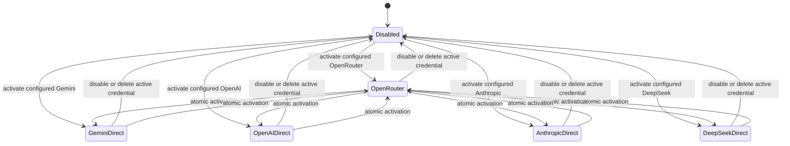

# Multi-provider AI architecture

- Phase: AI-2
- Status: design complete; waiting for human review
- Repository baseline: `eea4de2c1c476362a184604b13446d78e68fce4c`
- Scope: architecture only; no provider, credential, API, database, worker, or UI implementation is authorized

Related records: [AI-1 / AI-1R baseline](../planning/PHASE_AI_1_GEMINI_BASELINE.md),
[AI provider threat model](../security/AI_PROVIDER_THREAT_MODEL.md),
[AI-2 phase record](../planning/PHASE_AI_2_MULTI_PROVIDER_ARCHITECTURE_AND_THREAT_MODEL.md),
and [decision log](../planning/DECISION_LOG.md).

## Executive decision summary

Career Learning Hub will support five callable provider identities and one
disabled state:

- `openrouter`
- `gemini-direct`
- `openai-direct`
- `anthropic-direct`
- `deepseek-direct`
- `disabled`

Each user may save credentials for several providers, but one scalar field in
one owner-scoped `AiProviderPreference` document is the sole active-provider
authority. `disabled` means that zero providers are callable. Credential rows
do not carry an `active` flag.

OpenRouter and direct-provider execution are separate modes. OpenRouter mode
uses OpenRouter only. Its free attempt contains an ordered, task-specific
allowlist of free models. An optional paid attempt is a second OpenRouter
request to one explicit paid model after a fresh atomic budget reservation.
Direct mode calls only the selected direct provider and never falls back to
OpenRouter or another direct provider.

Every AI job receives an immutable routing snapshot at enqueue time. The
snapshot contains provider, model plan, routing-profile version, credential
reference and secret version, timeouts, and cost permissions, but never a
secret or ciphertext. Immediately before an outbound call, the worker must
prove that the snapshot is still authorized. Switching provider, replacing or
deleting the referenced credential, disabling AI, revoking paid permission,
or retiring an unsafe model makes the queued job stale and non-executable.

User-owned API keys are encrypted with AES-256-GCM under the server-only
`BYOK_ENCRYPTION_KEY`. Provider output remains untrusted. The provider-neutral
structural JSON Schema, strict post-response Zod parse, feature semantic
validation, ownership checks, work fences, quiz secrecy, and persistence
transactions established by DEC-017 remain authoritative.

## Existing baseline

At the baseline commit:

- React/Vite uses one shared API client, keeps access tokens in memory, sends
  credentials for the HttpOnly refresh cookie, preserves request IDs, and
  retries one unauthorized request after a deduplicated refresh.
- Express/TypeScript authenticates Bearer access tokens, derives ownership
  from server authentication state, validates inputs with Zod, applies exact
  CORS and rate limits, emits private `no-store` responses, and normalizes
  errors.
- MongoDB stores owner-bound domain records, a durable leased job queue,
  atomic daily request/token counters, and sanitized usage events.
- The worker validates job payloads, uses bounded retries, and preserves
  Learning work fences and transactional persistence.
- `GeminiProviderAdapter` is the only adapter. It reads `GEMINI_API_KEY` and
  `GEMINI_MODEL` from backend environment configuration.
- `ProviderStructuredRequest.responseJsonSchema` carries a provider-neutral
  structural schema. Gemini receives its compatible subset. Zod and feature
  semantics remain the enforcement boundary.
- Resume parse/analysis, Interview question generation/explanation/feedback,
  Learning summary/grounded chat, Flashcard generation, and Quiz generation
  share the gateway and job system.
- The current Settings page contains account and session information only.
- No general encryption vault exists. `backend/src/shared/crypto.ts` hashes
  tokens and IP addresses but does not encrypt secrets.

## Controlling invariants

1. A user has one execution state: exactly one callable provider or
   `disabled`.
2. Configured but inactive credentials are never resolved or called.
3. OpenRouter mode never resolves a direct-provider credential or endpoint.
4. Direct mode never calls OpenRouter or another direct provider.
5. OpenRouter paid fallback is off by default and requires an explicit model,
   per-action permission, per-request ceiling, daily paid-request allowance,
   and atomic spend reservation.
6. Plaintext credentials never persist, enter browser storage, appear in job
   payloads, usage/audit events, errors, or logs, or return from an API.
7. A job routing snapshot is immutable and auditable, but it is not a grant
   that survives provider/credential revocation.
8. Deleted, deleting, disabled, replaced, or undecryptable credentials cannot
   authorize a new outbound call.
9. Provider/model URLs are fixed server constants. Users select identifiers
   from validated catalogues; they cannot submit endpoints or arbitrary URLs.
10. Provider catalogues and provider output are untrusted until parsed and
    policy-validated.
11. Zod, feature semantics, ownership, fencing, answer secrecy, and
    transactional persistence remain authoritative after provider output.
12. Logical, gateway, worker, token, concurrency, and money limits are
    enforced atomically across application instances.
13. Raw prompts and responses are not stored by default.
14. Provider switches are never an automatic error-recovery action.

## Provider modes

### State machine



All omitted transitions between direct states use the same atomic activation
operation. A transition has one commit point: update the single preference
document using its current revision. There is no interval in which two
credential documents are active.

### Mode matrix

| Active state | Credential resolver | Allowed model plan | Allowed fallback |
| --- | --- | --- | --- |
| `disabled` | none | none | none |
| `openrouter` | active OpenRouter credential only | approved OpenRouter free list, then optional explicit OpenRouter paid model | inside OpenRouter only |
| `gemini-direct` | active Gemini credential only | approved Gemini model(s) | one bounded same-provider retry for verified transient failure |
| `openai-direct` | active OpenAI credential only | approved OpenAI model(s) | same provider only |
| `anthropic-direct` | active Anthropic credential only | approved Anthropic model(s) | same provider only |
| `deepseek-direct` | active DeepSeek credential only | approved DeepSeek model(s) | same provider only |

## Credential vault

### Secret format and encryption

`BYOK_ENCRYPTION_KEY` is required before user-owned credentials can be saved or
used. Its format is:

```text
v<positive-integer>:<base64url-without-padding-encoding-of-exactly-32-random-bytes>
```

Example values in documentation must always be placeholders. Startup rejects
invalid lengths, duplicate versions, version zero, padding, and known
placeholder text. The current key is encryption-capable. During rotation,
decrypt-only predecessors are supplied through a separately protected
`BYOK_ENCRYPTION_KEY_PREVIOUS` comma-separated key ring using the same format.
Only versions still referenced by stored credentials may be retained.

For every encryption or replacement:

- algorithm: AES-256-GCM;
- nonce: 12 cryptographically random bytes from the Node crypto RNG, never
  reused with a key;
- authentication tag: 16 bytes;
- stored encodings: base64url without padding, in separate `ciphertext`,
  `nonce`, and `authTag` fields;
- AAD version: `1`;
- AAD UTF-8 value:
  `clh|ai-credential|aad-v1|<credentialId>|<userId>|<provider>|<secretVersion>|<keyVersion>`.

The credential ID is allocated before encryption. Any mismatch in owner,
provider, secret version, or key version therefore fails authentication.
Encryption-key rotation changes `keyVersion` and ciphertext but not
`secretVersion`; user replacement increments `secretVersion` and uses a fresh
nonce.

### Secret lifecycle

- **Save:** validate provider and bounded key format, encrypt immediately, keep
  only a short masked suffix, and return metadata. Never return the key.
- **Test:** use the stored credential through the adapter. Tests use a
  provider-supported metadata/auth check or a fixed synthetic minimal request;
  no Resume, Interview, Learning, or other user content is sent.
- **Resolve:** require authenticated owner, active preference, exact provider,
  credential ID and secret version, non-deleted status, and a valid execution
  lease. Decrypt just in time.
- **Replace:** use `If-Match`/revision and an idempotency key. Encrypt the new
  secret, increment `secretVersion`, clear validation state, invalidate queued
  snapshots referencing the old version, and schedule old ciphertext removal
  in the same transaction.
- **Delete:** atomically set the credential to `deleting`, set the preference
  to `disabled` if it references that credential, and prevent new execution
  leases. Drain or abort existing leases. Only then unset ciphertext, nonce,
  tag, suffix, and validation metadata, set `deletedAt`, and return success.
- **Rotation:** add the new current key, re-encrypt credentials in bounded
  batches using compare-and-set on old key version and record revision, verify
  counts and sample decryptions without printing plaintext, then remove the old
  decrypt-only key only when no document references it. Rotation is resumable
  and idempotent.
- **Decryption failure:** never try another provider or credential. Mark the
  credential unusable with a sanitized reason, disable it if active, reject
  affected jobs with `credential_decryption_failed`, emit a security audit
  event, and alert an operator.

### Execution leases and deletion races

Before an outbound call, the worker creates a short-lived
`AiCredentialExecutionLease` in the same transaction that validates the job
snapshot, current preference, credential state, and secret version. Deletion
first changes the credential to `deleting`, so no new lease can be created. It
then signals known in-flight requests through their abort controllers and
waits for leases to close or expire before cryptographic fields are removed.
A deletion response means no new request can start with that credential; an
already accepted external request cannot be recalled, which remains a stated
provider-boundary limitation.

### Memory and backup expectations

Decrypted bytes live only for connection construction and are not cached in a
singleton, serialized, attached to errors, or copied into telemetry. Use a
mutable buffer where possible and overwrite it in `finally`; JavaScript string
copies cannot be guaranteed to be zeroized, so adapters must minimize string
conversion and lifetime.

Database backups contain ciphertext, nonces, tags, masked suffixes, and
metadata, while deployment-secret backups contain encryption keys. They must
be encrypted, access-controlled, audited, retained separately, and restored as
a matched set. Deleting a live record does not erase historical backups.
Backup expiry provides physical deletion; retirement of the referenced master
key provides cryptographic erasure only after all live credentials have moved
to a newer key.

## Active-provider state

Active state belongs in a separate `AiProviderPreference` document because:

- one scalar field is easier to make atomic than mutually exclusive flags on
  several credential rows;
- credentials retain an independent lifecycle and can be configured while
  inactive;
- `disabled` is explicit without inventing a credential;
- routing-profile and credential-source choices have a natural owner; and
- optimistic concurrency can reject simultaneous settings writes cleanly.

Activation runs in a MongoDB transaction:

1. authenticate the user and validate the provider enum;
2. read the preference at the `If-Match` revision;
3. for a callable provider, resolve an owned, connection-valid within policy
   freshness, non-deleting credential or an explicitly allowed
   administrator-managed source;
4. validate the active routing profile and selected models;
5. compare-and-set the preference to the new scalar provider/source/reference
   and increment `revision`;
6. emit a sanitized audit event after the transaction commits.

If two requests use the same revision, one wins and the other receives
`409 routing_configuration_invalid` with the new safe revision. An
unconfigured provider cannot be activated. Deleting the active credential or
choosing Disable AI sets `activeProvider=disabled`, clears credential/source
references, increments the revision, and makes queued snapshots stale.

## Provider interface

The provider-neutral contract should extend the existing adapter rather than
replace the gateway:

```ts
type ProviderId =
  | "openrouter"
  | "gemini-direct"
  | "openai-direct"
  | "anthropic-direct"
  | "deepseek-direct";

interface AiProviderAdapter {
  readonly id: ProviderId;
  testConnection(input: ConnectionTestRequest): Promise<ConnectionTestResult>;
  getModelCatalogue?(input: CatalogueRequest): Promise<ProviderModel[]>;
  validateModel(input: ModelValidationRequest): ModelValidationResult;
  generateStructured<T>(input: StructuredGenerationRequest<T>):
    Promise<StructuredGenerationResult>;
  streamStructured?<T>(input: StructuredStreamRequest<T>):
    AsyncIterable<ProviderStreamEvent>;
  normalizeError(error: unknown): NormalizedAiError;
}
```

Requests include provider identity, model or OpenRouter model plan, fixed
server endpoint, system/user prompt, provider-neutral `responseJsonSchema`,
maximum input/output tokens, timeout policy, cancellation signal, routing
snapshot ID, and an ephemeral credential handle. The handle can only reveal
the already-authorized credential to the selected adapter.

Results include actual model, provider request ID, validated token usage,
latency/TTFT, finish reason, pricing provenance when available, and sanitized
routing metadata. Adapters translate the same structural schema to the
provider's supported request form. The gateway still bounds response size,
parses JSON, applies strict Zod validation, and returns data to feature semantic
validators. Provider schemas never replace those controls.

Provider catalogue support is optional because not every provider exposes a
safe catalogue. Unsupported catalogue retrieval is a capability fact, not a
reason to scrape or invent model IDs. Direct model identifiers are
administrator-approved data and are validated by the adapter before use.

## Queue routing snapshot

### Snapshot shape

AI jobs add an immutable top-level `aiRoutingSnapshot` subdocument:

```text
snapshotId, snapshotVersion
userId, action
provider, mode
preferenceRevision
routingProfileId, routingProfileVersion
credentialSource
credentialId, credentialSecretVersion       # user-managed only
administratorCredentialPolicyVersion         # admin-managed only
freeModelIds[]                                # OpenRouter only
paidModelId, paidFallbackAllowed              # OpenRouter only
directModelId                                 # direct only
maximumInputTokens, maximumOutputTokens
maximumCostMicrousd, dailyPaidRequestCeiling
ttftMs, streamIdleMs, totalMs
catalogueVersion, pricingObservedAt
createdAt
```

The snapshot contains no plaintext, ciphertext, nonce, authentication tag,
environment variable, or raw provider object. It is created by a centralized
routing compiler before `enqueueJob`, validated again by the job handler, and
immutable after insertion.

### Execution rules

- **Provider switch before execution:** reject/cancel the job as stale. The
  former provider is now inactive and must not receive a call.
- **Credential replacement:** old `credentialSecretVersion` snapshots are
  stale. They do not silently use the new key.
- **Credential deletion/disable:** no execution lease can be created; reject
  with a safe configuration error.
- **Job retry:** reuse the same snapshot and model ordering. Never recompile
  against current preferences. The execution gate must still pass.
- **Paid permission or ceiling change:** lowering/revoking permissions makes a
  snapshot stale; raising a ceiling does not expand an already queued job.
- **Model retirement or catalogue safety change:** a hard-disabled model makes
  the job stale. Ordinary catalogue refresh does not reorder a frozen list.
- **Staleness window:** routing profiles define `executeBefore`; jobs claimed
  after it fail without a provider call.
- **Audit:** usage records store snapshot/profile/credential versions, planned
  and actual model, attempts, fallback reason, worker attempt, and terminal
  error.

Enqueueing an AI job and reserving its logical request/token ceiling occurs in
one transaction. Feature-domain creation that already uses a transaction must
include snapshot creation, budget reservation, and job insertion in that same
transaction or use an idempotent outbox equivalent.

## OpenRouter catalogue

A catalogue refresh fetches the official OpenRouter model endpoint through a
fixed URL, validates the complete response with a bounded schema, and writes a
new version only after validation succeeds.

Stored normalized fields include model ID, canonical slug when supplied,
context length, input/output modalities, supported parameters, maximum output,
pricing strings/Decimal128 values, provider capability metadata, first/last
seen times, last successful catalogue version, and missing/disabled state.
Unknown fields are ignored; missing required security fields fail the refresh.

A model is free for an action only when every price dimension the action can
consume is explicitly present and numerically zero. At minimum this includes
prompt, completion, and per-request prices, plus image/file/search/reasoning or
cache dimensions when the action can use them. Missing, unparsable, negative,
or stale pricing means **not free**. A `:free` suffix is supporting metadata,
never the decision.

Refresh behavior:

- refresh on startup without blocking startup if a still-valid cache exists;
- refresh approximately every six hours with jitter and one distributed
  refresh lease;
- serve the last valid catalogue while revalidating;
- never replace a valid version with an empty, partial, or invalid result;
- administrator-only manual refresh with strict rate limiting and audit;
- mark absent models `missing` after one successful refresh and disable them
  after a configurable grace period or immediately for a security/policy
  reason;
- retain old versions long enough to explain queued snapshots and usage;
- fail closed for paid routing when pricing is missing or beyond the approved
  staleness threshold.

The official documentation confirms that the models API exposes context,
modalities, supported parameters, and pricing, and that a pricing value of
`"0"` denotes a free dimension. See [OpenRouter models](https://openrouter.ai/docs/guides/overview/models)
and [Models API](https://openrouter.ai/docs/api/api-reference/models/get-models).

## Action profiles

An immutable per-user `AiRoutingProfile` compiles administrator policy and the
user's bounded preferences. Actual model IDs live in data, not source code or
this document.

| Action | Required capabilities and modality | Minimum context | Timeout | Output validator | Initial max output tokens | Initial paid permission / max cost |
| --- | --- | ---: | --- | --- | ---: | --- |
| `resume-parse` | text input, structured outputs | 128k | heavy; very large input becomes background | `parsedResumeSchema` + normalization | 8,192 | off / $0 |
| `resume-analysis` | text, structured outputs | 64k | heavy | `aiAnalysisResultSchema` + bullet/rewrite semantics | 8,192 | off / $0 |
| `resume-rewrite` | text, structured outputs | 32k | short | dedicated strict schema + factual/source-bullet semantics | 4,096 | off / $0 |
| `resume-job-comparison` | text, structured outputs | 64k | heavy | dedicated strict schema + supplied-source semantics | 4,096 | off / $0 |
| `interview-question-generation` | text, structured outputs | 32k | short | generated set schema + count/difficulty/uniqueness | 6,144 | off / $0 |
| `interview-question-explanation` | text, structured outputs | 16k | short | explanation schema + current-job fence | 2,048 | off / $0 |
| `interview-answer-feedback` | text, structured outputs | 32k | short | feedback schema + ownership/current-job fence | 4,096 | off / $0 |
| `learning-summary` | text, structured outputs | 128k | heavy; very large input becomes background | summary schema + document work fence | 4,096 | off / $0 |
| `learning-grounded-chat` | text, structured outputs | 32k | chat | chat schema + supplied-chunk citation semantics | 2,048 | off / $0 |
| `flashcard-generation` | text, structured outputs | 64k | heavy | flashcard schema + index/duplicate/chunk semantics | 8,192 | off / $0 |
| `quiz-generation` | text, structured outputs | 64k | chat | quiz schema + index/choice/chunk/answer secrecy | 8,192 | off / $0 |

Each profile also requires a ranked `freeModelIds` list selected from the
current valid catalogue, one optional explicit `paidModelId`, maximum input
tokens, `maximumCostMicrousd`, catalogue/pricing version, and
`allowValidationRegeneration`. The initial value of regeneration is false to
preserve DEC-017's deterministic non-retryable behavior. Enabling paid
fallback requires an explicit positive per-action cost cap no greater than the
server policy cap; there is no implicit default price ceiling.

## OpenRouter free/paid routing

### Default free mechanism

The default is one OpenRouter request using the official ordered `models`
array. The array contains only task-approved models proven free by the cached
catalogue. It never contains a paid model, `openrouter/auto`, or the randomized
`openrouter/free` router. This keeps ranking deterministic and auditable while
allowing OpenRouter to fail over among the exact approved free candidates.
OpenRouter documents that `models` are tried in priority order and that the
actual billed model is returned in the response: [model fallbacks](https://openrouter.ai/docs/guides/routing/model-fallbacks).

### Paid attempt

Paid fallback is a separate request, not another entry in the free array. It
runs only when all of these remain true at the execution gate:

1. OpenRouter is active and the same OpenRouter credential/version is valid;
2. the action profile and queued snapshot both permit paid fallback;
3. one exact paid model is approved and its current pricing is valid;
4. the request's worst-case cost is at or below its snapshot ceiling;
5. daily paid-request and spend ceilings have capacity;
6. an atomic money reservation succeeds; and
7. no usable answer-content token has been emitted to the user.

For current structured actions, the gateway may consume a provider stream
internally but buffers it until JSON, Zod, and feature semantics succeed.
Therefore an invalid free result has not been emitted. Automatic regeneration
after invalid output remains disabled initially; a future action profile may
enable one paid regeneration only after action-specific tests and budget
accounting exist.

OpenRouter reports the actual model in the response. Store that model and
whether the separate paid attempt ran. Never infer success, cost, or tier from
the requested model alone.

## Direct-provider behavior

- The active direct provider is resolved once from the job snapshot and
  current preference gate.
- Only its adapter and fixed endpoint can receive the credential and request.
- Default and optional per-action models must be approved for that provider.
- OpenRouter credentials and all other direct credentials are inaccessible to
  the adapter's credential handle.
- `400`, `401`, `402`, and `403` are not retried.
- `429` is retried once when the bounded `Retry-After` fits the total deadline.
- `500`, `502`, `503`, `529`, verified overload, and network timeout may retry
  once with jitter against the same provider/model.
- Invalid schema or semantic output is deterministic and non-retryable by
  default. A profile may later permit exactly one same-provider/model
  regeneration for an idempotent non-streaming action after explicit tests.
- The second failure stops. The UI may offer a user-initiated retry, which
  creates a new job and a new routing snapshot.

## Streaming and timeout policy

| Profile | TTFT | Stream idle | Total |
| --- | ---: | ---: | ---: |
| Short interactive | 8 s | 15 s | 45 s |
| Chat and quiz | 10 s | 15 s | 60 s |
| Heavy analysis | 12 s | 20 s | 90 s |

TTFT is measured to the first usable answer-content token. Response headers,
an opened SSE connection, keep-alive comments, reasoning metadata, debug
events, and provider-status events do not satisfy TTFT.

Cancellation uses one propagated `AbortSignal` from client disconnect, job
cancellation, credential deletion, TTFT timeout, idle timeout, or total
deadline. A retry or fallback never extends the snapshot's total deadline.
Very large documents remain background jobs with action-specific deadlines
and progress rather than a blocking request.

Before the first usable token, OpenRouter may run its approved paid attempt if
all gates pass. After usable content begins, no provider/model output is mixed
or silently replaced. The response ends in `stream_interrupted`, preserves
the partial text only in browser memory unless the feature explicitly defines
safe draft storage, and offers an explicit retry using the configured paid
OpenRouter model. Direct modes offer explicit same-provider retry only.

Initial multi-provider delivery should keep current structured flows
non-streaming to the browser. Streaming is enabled per action only when its
transport, cancellation, partial-state UX, final structural/semantic
validation, and secrecy tests are complete.

## Error taxonomy

All categories prohibit automatic provider switching. Common sanitized log
fields are request ID, user ID, action, selected provider/model identifier,
routing snapshot/profile version, job ID, gateway/worker attempt, normalized
category, status, latency bucket, and a hash of an opaque provider request ID.
Raw bodies, prompts, output, credentials, headers, and encryption fields are
never logged.

| Category | CLH HTTP | Retry / same-provider rule | Safe message | Permitted UI action |
| --- | ---: | --- | --- | --- |
| `provider_not_configured` | 409 | no | Configure the selected AI provider. | Open Settings |
| `invalid_credentials` | 409 | no | The provider credential is invalid. | Replace/test credential |
| `permission_denied` | 403 | no | The provider denied this request. | Review provider access |
| `insufficient_balance` | 402 | no | The provider account has insufficient balance. | Add credit/disable paid |
| `quota_exhausted` | 429 | no automatic retry | The provider quota is exhausted. | Retry later |
| `spending_limit_reached` | 429 | no | The configured spending limit was reached. | Review limits |
| `rate_limited` | 429 | once if bounded `Retry-After` fits | The provider is rate limiting requests. | Wait/retry |
| `model_not_found` | 422 | no | The selected model is unavailable. | Choose approved model |
| `model_unavailable` | 503 | once, same provider | The selected model is temporarily unavailable. | Retry |
| `provider_overloaded` | 503 | once, same provider | The provider is temporarily overloaded. | Retry |
| `request_timeout` | 504 | once if total deadline permits | The AI request timed out. | Retry |
| `stream_idle_timeout` | 504 | only before usable content | The AI stream stopped responding. | Retry |
| `stream_interrupted` | 502 | no automatic retry after content | The response was interrupted. | Explicit retry |
| `context_too_large` | 413 | no | The content is too large for the selected model. | Reduce/background action |
| `invalid_request` | 400 | no | The AI request could not be accepted. | Correct input/settings |
| `invalid_provider_output` | 502 | no by default | The provider returned an unusable response. | Explicit retry |
| `content_blocked` | 422 | no | The provider could not process this content. | Edit input |
| `network_error` | 503 | once, same provider | The provider could not be reached. | Retry |
| `credential_decryption_failed` | 503 | no | The saved credential cannot be used. | Replace credential/contact support |
| `routing_configuration_invalid` | 409 | no | AI routing settings changed or are invalid. | Refresh Settings/retry |
| `paid_fallback_not_permitted` | 409 | no | Paid fallback is not permitted. | Enable within limits |
| `daily_budget_exceeded` | 429 | no | The daily AI budget has been reached. | Wait/review limits |
| `unknown_provider_error` | 502 | no automatic retry | The provider request failed. | Retry/contact support |

Provider status/error bodies are mapped inside adapters. The public error
includes only category, safe message, request ID, optional bounded retry time,
and permitted action code. It never includes a provider response object.

## Usage and cost controls

### Recorded fields

Each logical request and attempt records user, action, active provider, planned
and actual model, free/paid tier, routing snapshot/profile version,
credential reference and secret version, request count, input/output tokens,
latency and TTFT, gateway and worker attempts, fallback used/reason, estimated
and reconciled cost, bounded provider request ID, success/failure, normalized
error, and timestamp. Prompts and full responses are absent by default.

### Atomic enforcement

At reservation time, derive a worst-case token and cost bound from the action
profile and current trusted pricing. Money is stored as integer micro-USD,
rounded upward. One MongoDB transaction creates a pending usage event and
conditionally increments the owner/day counter only if all limits remain
within:

- per-request input/output token ceilings;
- per-user daily logical-request and token ceilings;
- OpenRouter daily paid-request and spend ceilings;
- per-request maximum cost;
- per-user and global concurrency ceilings; and
- action/provider cooldown state.

Settlement transactionally converts the pending event to success/failure,
reconciles actual tokens/cost, and releases concurrency and unused money.
Retries and fallback attempts have separate attempt records but one logical
request. A stale-pending reconciler uses reservation IDs and provider outcome
evidence; it never assumes an unconfirmed request cost is zero.

Missing or stale pricing is fail-closed for paid routing and excludes a model
from free routing. Provider-reported usage is validated as non-negative and
bounded. Unexpected actual cost above reservation triggers an alert and
freezes further paid requests while preserving the immutable event.

Initial policy retains the existing daily request/token limits. Paid fallback
defaults to disabled, zero paid requests, and zero spend until the user sets
positive limits within administrator caps. Database counters, not process-local
rate limiters, are authoritative for cost and concurrency.

## Usage transparency

Safe API/UI metadata may show active provider, actual model, free/paid tier,
fallback used, response latency/TTFT, input/output tokens, estimated or actual
cost when pricing provenance is reliable, gateway retry count, and
interruption state. It must label estimates and unavailable data honestly.

Never return credential IDs unless the UI needs an opaque same-owner version
token; prefer provider plus masked suffix and version. Never expose ciphertext,
key version, provider raw responses, internal routing diagnostics, prompt
content, private document content, or provider authorization state beyond a
safe connection status.

## API contracts

### Common controls

All endpoints require the existing Bearer authentication and derive `userId`
from `request.auth`. They use strict Zod schemas, exact provider enums,
`Cache-Control: private, no-store`, normalized errors, request IDs, and both
global IP and endpoint-specific owner rate limits. Mutations require an
allowed Origin; the HttpOnly refresh cookie is not authorization for these
routes, but exact Origin validation remains a CSRF defense. UI actions must not
use GET for mutation.

`Idempotency-Key` is required for cost-generating tests and mutation retries.
`If-Match` carries the safe preference or credential revision where noted.
Security audit events contain actor, action, provider, revisions, outcome,
request ID, and time—never secret or content.

### Endpoint matrix

| Endpoint | Authorization and rate limit | Request | Success | Idempotency / audit |
| --- | --- | --- | --- | --- |
| `GET /api/v1/ai/providers` | owner; 120/15 min/user | none | provider cards, configured/status/suffix/last-tested, active state, safe revisions | read only; no audit |
| `PUT /api/v1/ai/providers/:provider/credential` | owner; 10/hour/user and 30/hour/IP | `{ apiKey, label? }`, strict; `If-Match` for replace | `200/201` metadata without secret | required key; audit save/replace |
| `POST /api/v1/ai/providers/:provider/test` | owner; 10/15 min/user | `{ credentialVersion }`, strict; no raw key | `200` safe connection status/model capability summary | required key; usage + audit |
| `PATCH /api/v1/ai/providers/:provider/activate` | owner; 20/hour/user | `{ credentialSource, routingProfileVersion }` + preference `If-Match` | `200` active state and new revision | required key; audit activate/switch |
| `PATCH /api/v1/ai/providers/:provider/preferences` | owner; 30/hour/user | bounded provider-specific model/limit/timeouts; `If-Match` | `200` compiled profile and revision | required key; audit change |
| `DELETE /api/v1/ai/providers/:provider/credential` | owner; 10/hour/user | credential `If-Match`; no body | `204` after delete or `202` safe deletion-pending state | required key; audit delete; repeat is safe |
| `GET /api/v1/ai/models` | owner; 120/15 min/user | provider/action/filter query, bounded | approved safe model metadata and catalogue freshness | read only |
| `POST /api/v1/ai/models/refresh` | authenticated `admin` only; 6/hour/operator | `{ provider: "openrouter" }` | `202` refresh job/status ID | required key; admin audit |
| `GET /api/v1/ai/routing` | owner; 120/15 min/user | none | active provider, compiled per-action safe routing and revision | read only |
| `PUT /api/v1/ai/routing` | owner; 20/hour/user | complete strict routing preferences + `If-Match` | `200` compiled routing/profile revision | required key; audit |
| `GET /api/v1/ai/usage` | owner; 120/15 min/user | bounded date/action/provider pagination | owner totals/events without content or secrets | read only |

`POST /models/refresh` requires a new server-side admin guard because the
current repository stores roles but has no general admin authorization
middleware. It must read `request.user.roles`; client-supplied roles never
authorize it.

Safe errors are limited to the taxonomy above plus ordinary authentication,
validation, conflict, and rate-limit responses. Credential endpoints never
return `apiKey`, ciphertext, nonce, tag, key version, AAD, full suffix, raw
test response, or environment-source details.

## MongoDB design

### `AiCredential`

Fields: `_id`, `userId`, `provider`, `label`, `maskedSuffix`, `secretVersion`,
`state` (`configured|valid|invalid|deleting|deleted`), `connectionStatus`,
`lastValidatedAt`, safe `lastValidationError`, `encryptedSecret.ciphertext`,
`encryptedSecret.nonce`, `encryptedSecret.authTag`,
`encryptedSecret.keyVersion`, `encryptedSecret.aadVersion`, `replacedAt`,
`deletedAt`, `createdAt`, `updatedAt`, and integer `revision`.

Indexes:

- unique partial `{ userId: 1, provider: 1 }` where `deletedAt` is absent;
- `{ userId: 1, state: 1, updatedAt: -1 }`;
- `{ "encryptedSecret.keyVersion": 1, state: 1 }` for rotation.

Encrypted fields are `select:false` by default. No `active` field exists.

### `AiProviderPreference`

Fields: `_id`, `userId`, `activeProvider`, `credentialSource`,
`activeCredentialId`, `activeCredentialSecretVersion`,
`administratorCredentialPolicyVersion`, `routingProfileId`,
`routingProfileVersion`, `revision`, `disabledReason`, `createdAt`, and
`updatedAt`.

Indexes: unique `{ userId: 1 }`; `{ activeProvider: 1, updatedAt: -1 }` for
safe operations metrics. Cross-field schema validation requires no credential
for `disabled`, exactly one valid source for callable states, and matching
provider/reference for user-managed credentials. Atomicity comes from one
document plus transactional compare-and-set on `revision`.

### `AiRoutingProfile`

Immutable fields: `_id`, `userId`, integer `version`, `status`
(`active|retired`), `activeMarker` (present only when active),
`policyVersion`, catalogue/pricing versions, and the eleven action profiles.
Each action profile stores capabilities, modalities, minimum context, ranked
free IDs, optional paid/direct model, token/cost caps, timeout profile,
validator ID/version, fallback/regeneration permissions, and `executeBefore`
policy.

Indexes: unique `{ userId: 1, version: 1 }`; unique partial
`{ userId: 1, activeMarker: 1 }` where `activeMarker="active"`; and
`{ status: 1, updatedAt: -1 }`. Publishing a new profile and switching the
preference occur in one transaction; old versions remain auditable.

### `OpenRouterModelCatalogue`

Model-entry fields: `modelId`, canonical slug, name, context/output limits,
input/output modalities, supported parameters, pricing as original decimal
strings and parsed Decimal128 values, `freeEligibilityByCapability`,
`catalogueVersion`, `firstSeenAt`, `lastSeenAt`, `missingSince`, `disabledAt`,
and safe disable reason.

Indexes: unique `{ modelId: 1 }`; `{ catalogueVersion: 1, modelId: 1 }`;
`{ "freeEligibilityByCapability.structuredText": 1, lastSeenAt: -1 }`; and
`{ missingSince: 1 }`.

A singleton `OpenRouterCatalogueState` stores `currentVersion`, ETag/validator
when available, `lastAttemptAt`, `lastSuccessAt`, item count, freshness state,
refresh lease owner/expiry, and a sanitized last failure. Unique constant
`{ singleton: 1 }` prevents multiple state documents. Refresh writes entries
and flips `currentVersion` only after a complete valid staging version exists.

### `UsageEvent` and daily counters

Extend `UsageEvent` with `reservationId`, `logicalRequestId`, `action`,
`routingSnapshotId`, profile/credential versions, planned and actual model,
tier, gateway/worker attempt, fallback fields, TTFT, provider request ID,
estimated/reserved/actual cost in micro-USD, pricing version, and status
`pending|success|failure|interrupted|reconciled`. Keep prompts/responses absent.

Indexes: unique `{ reservationId: 1 }`; `{ userId: 1, createdAt: -1 }`;
`{ userId: 1, action: 1, createdAt: -1 }`;
`{ userId: 1, tier: 1, createdAt: -1 }`; and
`{ status: 1, updatedAt: 1 }` for stale reconciliation.

Extend the existing owner/day `AiQuotaCounter` with logical requests, used and
reserved tokens, paid requests, reserved/settled micro-USD, active requests,
and cooldown state. Preserve unique `{ userId, dateKey }` and TTL. Conditional
updates enforce every ceiling in one atomic operation; reservation/settlement
transactions include the UsageEvent.

### `SecurityAuditEvent`

Fields: `_id`, `actorUserId`, `subjectUserId`, actor role, action, provider,
credential safe version, preference/profile versions, request ID, outcome,
normalized reason, source IP hash, user-agent hash, occurred/created times, and
retention expiry. No secret, provider body, prompt, document, or response.

Indexes: `{ subjectUserId: 1, occurredAt: -1 }`,
`{ actorUserId: 1, occurredAt: -1 }`, `{ action: 1, occurredAt: -1 }`, and TTL
`{ expiresAt: 1 }`. Security audit data is operator-only unless a later privacy
decision defines a safe user view.

### Credential execution leases

`AiCredentialExecutionLease` stores credential ID, secret version, routing
snapshot/job/attempt IDs, worker ID, state, acquired/heartbeat/expiry times,
and no secret. Indexes are unique `{ attemptId: 1 }`,
`{ credentialId: 1, state: 1 }`, and TTL `{ expiresAt: 1 }`. Acquisition is in
the execution-gate transaction; release is idempotent.

## Settings UI architecture

Settings adds an **AI Provider Connections** section with one card for each
provider. Cards show configured state, masked suffix, password-style key
entry, connection state, last test, replace/delete/test actions, and approved
model selectors. Key values stay only in controlled component memory until
submission, are cleared in `finally`, never enter URLs, browser storage,
analytics, error reports, or DOM after save, and are never rehydrated.

An **Active AI Provider** single-choice group contains OpenRouter, four direct
providers, and Disable AI. Saving uses the visible preference revision; a
conflict refreshes state instead of silently overwriting another tab.

OpenRouter-only controls show free-first routing, per-action ranked approved
free profiles, paid fallback off/on, explicit paid model, paid request/spend
and per-request ceilings, timeout profiles, catalogue freshness, and an
administrator-only refresh action. Direct cards show default/per-action model,
same-provider retry text, usage, and an explicit no-cross-provider-fallback
notice.

Every view has loading, configured/unconfigured, validating, valid/invalid,
deleting, conflict, error, and success states. Destructive actions require
confirmation. The API response is trust-boundary validated before rendering.
React text rendering remains the XSS boundary; no provider HTML is rendered.

## Legacy Gemini migration

AI-2 changes no environment behavior. Later implementation proceeds in
reversible stages:

1. **Foundation:** add the vault, preferences, routing compiler, audit, and
   tests while the current environment Gemini path remains the only execution
   path.
2. **Dual-read compatibility:** represent `GEMINI_API_KEY` as an
   `administrator-managed` source without copying it into MongoDB. It is
   available only when an explicit server policy enables it.
3. **Explicit assignment:** existing behavior is preserved only for users
   explicitly assigned/opted into the administrator-managed Gemini source.
   Selecting Gemini Direct with no assignment and no user credential fails
   closed; it never silently consumes the administrator key.
4. **User BYOK:** allow encrypted user Gemini credentials, test them, and let
   the user explicitly activate `gemini-direct` with `user-managed` source.
   The UI labels “Your credential” and “Administrator-managed credential” and
   never implies ownership of the latter.
5. **Routing cutover:** enqueue immutable snapshots for all AI actions. Drain
   or invalidate legacy unsnapshotted jobs before disabling the legacy route.
6. **Deprecation:** remove environment-only implicit routing only after all
   actions pass provider/gateway/worker/ownership/accounting tests, every
   eligible user has an explicit preference, rollback has been rehearsed, and
   no queued legacy job remains.

Administrator-managed Gemini may remain supported for supervised deployment,
but it stays environment/secret-manager backed, requires explicit operator
enablement and per-user authorization, is clearly labeled, and is never an
automatic fallback. It is not a global credential silently shared by all
users.

Rollback re-enables the last compatible routing compiler and
administrator-managed Gemini policy without changing or decrypting user
credentials. Jobs created by a newer unsupported snapshot version are stopped,
not downgraded or rerouted. Database additions remain backward-compatible
until rollback and data-retention windows expire.

## Rollout and rollback

- Ship schemas, encryption, and migrations behind disabled feature flags.
- Verify key backup/restore and rotation before accepting credentials.
- Enable one provider adapter at a time with synthetic fixtures and mocked
  contract tests before approved live tests.
- Enable routing snapshot creation before any provider switching UI.
- Enable OpenRouter free mode before paid fallback.
- Enable paid fallback only after pricing, reservation, reconciliation,
  concurrency, and interruption tests pass.
- Enable streaming per action last.
- Preserve a kill switch that sets execution to disabled without deleting
  credentials.
- Rollback never selects another provider and never widens a frozen budget.

## Rejected alternatives

| Alternative | Decision and reason |
| --- | --- |
| Multiple active providers | Rejected; conflicts with user intent, auditability, and isolation. |
| Direct-provider cross-fallback | Rejected; can disclose data and spend to an unselected provider. |
| Keys in `localStorage`/`sessionStorage` | Rejected; exposes durable secrets to XSS/extensions and violates repository auth rules. |
| Plaintext keys in MongoDB | Rejected; database disclosure becomes immediate provider compromise. |
| Credentials or ciphertext in jobs | Rejected; expands secret copies and retention. Jobs hold references only. |
| Resolve provider only at worker time | Rejected; destroys enqueue-time consent, budget, and audit consistency. |
| Snapshot survives provider deactivation | Rejected; inactive providers must never receive requests. |
| `openrouter/auto` by default | Rejected; model and cost are not sufficiently bounded. |
| Random `openrouter/free` as the default | Rejected; task-specific ranking and auditability require an explicit list. |
| Hardcoded volatile free IDs | Rejected; catalogue data and pricing change. |
| Automatic paid fallback without limits | Rejected; concurrency can create unbounded spend. |
| Provider schema replaces Zod | Rejected; violates DEC-017 and omits feature semantics. |
| Raw provider errors | Rejected; bodies may contain sensitive content or credentials. |
| One global credential for all users | Rejected as a default. A narrowly authorized administrator-managed migration source may exist, but never silently. |
| Store raw prompts/responses | Rejected by default; unnecessary privacy and breach exposure. |

## Open questions

1. Which deployment secret manager and backup system will hold the current and
   decrypt-only encryption keys?
2. Will administrator-managed Gemini remain after migration, and which users
   may opt into it?
3. What server-wide maximum paid cost/spend caps should bound user settings?
4. What privacy/retention terms apply to each provider and model endpoint,
   including training and zero-data-retention options?
5. Does the production MongoDB topology and worker deployment support the
   required transactions, distributed refresh lease, and unique worker IDs?
6. Does the OpenRouter catalogue endpoint require a server catalogue-only
   credential in the target deployment? If so, it must be isolated from user
   execution credentials. This must be confirmed against official docs during
   AI-4.
7. Which direct-provider catalogue, streaming, structured-output, and request
   ID capabilities are officially supported at implementation time?
8. What retention periods are approved for usage, audit, catalogue history,
   deleted credential tombstones, and routing snapshots?

No provider model ID, price, account limit, or error payload not established
by repository evidence or current official documentation is assumed here.

## AI-3 through AI-8 implementation map

### AI-3 — Vault, preference, API, and migration foundation

- Implement encryption/key parsing, credential/preference/profile schemas,
  ownership, optimistic activation, audit events, and API contracts.
- Add routing snapshot schema/compiler and execution gate without adding a
  second provider.
- Preserve environment Gemini through the explicit compatibility policy.
- Verify cryptography vectors, nonce uniqueness, AAD swaps, IDOR, CSRF/Origin,
  concurrent activation, replace/delete races, job staleness, logs, backups,
  migration, and rollback.

### AI-4 — OpenRouter catalogue and free-only adapter

- Implement validated catalogue refresh/cache/expiry and fixed endpoint.
- Compile all eleven action profiles from approved dynamic free candidates.
- Implement OpenRouter connection test, structured schema translation,
  ordered free `models` request, actual-model capture, and normalization.
- Verify catalogue poisoning/empty refresh/staleness, free-price classification,
  capability filtering, no direct credential resolution, fallback ordering,
  Zod/semantic authority, timeout/cancellation, and usage records.

### AI-5 — Direct-provider adapters and isolation

- Add Gemini BYOK cutover, then OpenAI, Anthropic, and DeepSeek adapters one at
  a time using current official contracts.
- Implement model validation/catalogue capability where supported.
- Verify fixed endpoints, credential-handle isolation, same-provider retry,
  no cross-provider fallback, structured-output translation, error redaction,
  and provider-specific contract fixtures.

### AI-6 — Streaming and interruption semantics

- Add authenticated stream transport, TTFT/idle/total deadlines, cancellation,
  final validation, and explicit interrupted states per approved action.
- Start with grounded chat; keep other actions buffered until their semantic
  and secrecy gates can be preserved.
- Verify pre-content fallback, no post-content mixing, disconnect abortion,
  backpressure, heartbeat exclusion from TTFT, partial-data non-persistence,
  and desktop/mobile human visual QA.

### AI-7 — Paid OpenRouter fallback and cost enforcement

- Add explicit paid models, atomic micro-USD reservation, settlement,
  reconciliation, cooldowns, transparency, and alerts.
- Verify concurrent spend attempts, stale pricing, missing usage, failed and
  duplicate attempts, crash recovery, no paid model in free arrays, no
  fallback after content, limit reduction, and zero-default behavior.

### AI-8 — Full integration, migration closeout, and operations

- Complete Settings UI, usage views, administrator catalogue controls,
  provider/privacy disclosures, key rotation/deletion runbooks, monitoring,
  migration/cutover, and rollback rehearsal.
- Run full unit/integration/security/typecheck/build gates, authorized
  provider-live tests with synthetic content, queue multi-worker tests, and
  required human visual QA.
- Deprecate implicit environment Gemini only after explicit approval. Do not
  remove rollback data or begin deployment without separate authorization.

Dependencies are strict: AI-3 precedes all routing; AI-4 precedes AI-7; AI-5
depends on AI-3; AI-6 depends on stable adapters and snapshots; AI-7 depends on
catalogue/pricing and usage reservations; AI-8 closes only after AI-3 through
AI-7 are verified.
