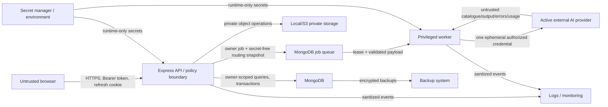

# Career Learning Hub repository threat model

## Overview

Career Learning Hub is a multi-user React/Vite and Express/TypeScript web
application backed by MongoDB, private local or S3 object storage, and a
MongoDB-leased worker. It stores and processes private Resume, Interview, and
Learning data. AI workflows currently use one environment-configured direct
Gemini adapter. The approved AI-2 design adds user-owned encrypted credentials,
exactly-one-active-provider routing, OpenRouter free/paid routing, four direct
provider modes, immutable queued-job routing snapshots, and cost controls.

This document is repository-scoped. It describes security invariants and
failure classes for the product as a whole and gives extra depth to the new AI
boundary. It is not a scan, does not report vulnerabilities in the current
diff, and does not claim that planned AI-2 controls already exist.

The planned controls are specified in the
[multi-provider AI architecture](../architecture/MULTI_PROVIDER_AI_ARCHITECTURE.md),
and execution evidence is tracked in the
[AI-2 phase record](../planning/PHASE_AI_2_MULTI_PROVIDER_ARCHITECTURE_AND_THREAT_MODEL.md).

Primary runtime surfaces are:

- the browser application and its in-memory authentication state;
- the Express API, authentication, validation, ownership, CORS, rate limits,
  private response caching, and error normalization;
- MongoDB domain records, authentication sessions, jobs, quotas, usage, future
  credentials, preferences, routing profiles, catalogues, and audits;
- private Resume and Learning files in local or S3 storage;
- the privileged job worker and its leases, retries, work fences, and
  transactions;
- direct AI provider and OpenRouter outbound boundaries; and
- deployment environment, secret manager, backup, logging, monitoring, build,
  and dependency systems.

The highest-impact outcomes are cross-tenant access, provider-key or master-key
disclosure, broad private-document disclosure, unauthorized paid spend,
silent execution through an inactive provider, authentication takeover,
private storage exposure, quiz-answer disclosure, and untrusted model output
driving privileged persistence.

## Threat Model, Trust Boundaries, and Assumptions

### Assets and privileges

| Asset or privilege | Security objective |
| --- | --- |
| Provider API keys | Owner-only use; encrypted at rest; never returned, logged, or placed in jobs |
| `BYOK_ENCRYPTION_KEY` and predecessors | Server/operator only; separate from database and backups; versioned rotation |
| Credential ciphertext, nonce, tag, suffix, and versions | Integrity-bound to owner/provider/version; unusable without master key |
| Active-provider state and routing profiles | Exactly one callable provider or disabled; atomic, auditable changes |
| OpenRouter free/paid model plan | Approved, capability-valid, price-bounded, and frozen per job |
| OpenRouter credits and direct-provider quota | No unauthorized or concurrency-amplified consumption |
| Resume, job descriptions, Interview answers, Learning documents/messages | Owner-only access; disclosed only to the explicitly active provider for the requested action |
| Prompts and responses | Minimized, not logged or stored by default, untrusted before validation |
| Job payloads, results, leases, and routing snapshots | Owner-bound, secret-free, immutable routing, stale work rejected |
| Usage, quota, budget, and audit records | Accurate, concurrency-safe, content-free, tamper-evident enough for investigation |
| MongoDB and private object storage | Confidentiality, tenant isolation, integrity, bounded retention |
| Authentication sessions and tokens | Confidentiality, expiry, revocation, owner binding |
| Quiz correct answers and explanations | Absent from taking APIs until successful owned submission |
| Server, worker, admin, migration, and key-rotation privileges | Least privilege, authenticated operation, complete audit trail |

### Actors

- Anonymous users can reach public authentication and health surfaces.
- Authenticated users control their own requests, identifiers, files, content,
  provider credentials, model/limit settings, and request timing.
- A cross-tenant attacker is an authenticated user who guesses or obtains
  another user's identifiers.
- Browser XSS, a malicious extension, or compromised frontend dependency acts
  in the user's browser origin and can observe values present in that process.
- External providers and OpenRouter receive constructed prompts and return
  untrusted catalogues, responses, errors, usage, and request IDs.
- Workers are privileged internal actors that can read owner data, resolve one
  credential, and initiate paid external requests.
- Administrators/operators control deployment configuration, master keys,
  administrator-managed provider credentials, catalogue policy, migrations,
  backups, and incident response.
- Developers and supply-chain systems control source, dependencies, builds,
  tests, and deployment artifacts.

### Attacker-controlled inputs

- methods, paths, headers, bearer tokens, cookies, JSON, query strings,
  multipart files, object IDs, idempotency keys, and concurrent timing;
- API-key fields, labels, activation requests, model selections, paid limits,
  timeout preferences, and delete/replace races;
- Resume content, job descriptions, Interview questions/answers/notes,
  Learning PDFs, document text, chat messages, Flashcard focus, and Quiz focus;
- malicious PDFs and oversized, repeated, or adversarial AI requests;
- provider catalogue documents, model capabilities, pricing, response streams,
  structured output, error bodies, usage fields, and request IDs; and
- stale or replayed job, credential, preference, routing-profile, and catalogue
  versions.

Operator-controlled inputs include environment secrets, encryption-key rings,
administrator credentials, provider/model allowlists, deployment topology,
retention, budget caps, catalogue refresh, migration, rollback, and backups.
Developer-controlled inputs include source, schemas, dependency versions,
tests, CI configuration, and migrations. Neither category is treated as
ordinary user input, but compromise or misuse has a larger blast radius.

### Trust boundaries

Boundary details:

1. **Browser to backend:** the browser is untrusted. Bearer authentication,
   exact CORS/Origin policy, strict validation, rate limits, and server-derived
   ownership enforce policy.
2. **Backend to MongoDB:** MongoDB is trusted persistence but not a plaintext
   credential vault. Owner filters, unique indexes, transactions, encrypted
   secret fields, and backup controls matter.
3. **API to worker:** jobs persist longer than requests. Payload schemas,
   owner IDs assigned by the server, immutable routing snapshots, leases,
   cancellation, and work fences prevent confusion and stale writes.
4. **Backend/worker to providers:** private content and money cross an external
   boundary. Only the active provider may be contacted, endpoints are fixed,
   requests are bounded, and all outputs are untrusted.
5. **Environment secrets to runtime:** JWT, signing, database, storage,
   administrator-provider, and BYOK master secrets enter privileged processes
   and must never enter logs, responses, source, or database plaintext.
6. **Provider catalogue to cache:** remote pricing/capabilities influence
   routing and spend but cannot authorize themselves; schema and policy checks
   are mandatory.
7. **Logs/monitoring:** observability is a lower-trust copy boundary. Only
   sanitized identifiers, categories, counts, and hashes belong there.
8. **Deployment/backups:** operators and backup systems can access broad
   ciphertext and secrets. Separation, encryption, access logging, restore
   drills, and retention are required.

### Security invariants

1. Every private query derives `userId` from authenticated server state.
2. Foreign and missing owned resources have equivalent safe behavior.
3. Plaintext provider keys never persist or return after save.
4. Ciphertext authentication binds credential ID, owner, provider, secret
   version, and encryption-key version.
5. Nonce reuse under the same AES-GCM key is prohibited.
6. Each user has one active execution state; `disabled` calls no provider.
7. Inactive provider credentials cannot be resolved by a gateway or worker.
8. Direct mode never cross-falls back. OpenRouter fallback stays inside
   OpenRouter.
9. Paid fallback requires current permission, an approved exact model, trusted
   pricing, and atomic budget reservation.
10. Jobs freeze an auditable routing snapshot but must pass current revocation,
    credential-version, model-safety, and execution-deadline gates.
11. Deleting/replacing a credential prevents new outbound use of the old
    secret; deletion drains/aborts execution leases before zeroing ciphertext.
12. Users cannot control provider base URLs, paths, DNS targets, or arbitrary
    request headers.
13. Provider catalogues cannot authorize paid or incapable models merely by
    naming or suffix.
14. Provider output is untrusted until size, JSON, strict Zod, feature
    semantics, ownership, fencing, and secrecy checks pass.
15. Prompt injection cannot change routing, access a credential, invoke tools,
    query arbitrary records, or alter system policy.
16. Cost, quota, and concurrency limits remain atomic across replicas and
    retries.
17. Raw provider bodies, prompts, documents, answers, keys, and encryption
    material never enter public errors, usage/audit events, or logs.
18. Correct Quiz answers remain server-private until successful owner-scoped
    submission.
19. Private files remain private and owner-authorized at storage access.
20. Administrator and migration actions are explicit, least-privileged,
    idempotent, reversible where possible, and audited.

### Assumptions and out-of-scope attacker stories

- Production transport terminates HTTPS, deployment secrets are high entropy,
  MongoDB supports transactions, private S3/local storage is not public, and
  proxy/rate-limit topology is correctly configured.
- The multi-provider design assumes a shared database counter/lease mechanism
  before multiple API/worker replicas enforce money or concurrency limits.
- External providers necessarily see content included in an initiated AI
  workflow. Contractual retention/training behavior is an operator and user
  disclosure decision, not something application encryption can prevent.
- A fully compromised API/worker process can read active plaintext keys and
  user content. The design reduces persistence and blast radius but cannot
  protect secrets from code executing with the same runtime privilege.
- A malicious database administrator with no master key sees ciphertext and
  metadata; collusion with a master-key administrator defeats that separation.
- Provider-side model quality, policy, or training behavior is outside source
  control. The application remains responsible for data minimization,
  validation, user disclosure, and provider selection.
- Denial of service against a provider's infrastructure is outside repository
  control; bounded retries, deadlines, queues, and user-visible errors limit
  amplification.
- Legacy sibling projects, real production exports, provider internals, and
  untracked infrastructure are outside repository scope.

## Attack Surface, Mitigations, and Attacker Stories

### Existing repository controls

Current controls that materially reduce risk include Bearer authentication
with active-session checks, server-derived ownership, safe 404 behavior,
strict Zod request schemas, exact CORS, private `no-store` responses, request
IDs, rate limits before body parsing, bounded upload/page/text sizes, private
storage adapters, in-memory browser access tokens, HttpOnly refresh cookies,
sanitized logging, owner-bound job polling, payload validation, leases,
idempotency, MongoDB transactions, Learning deletion fences, structural
provider JSON Schema, strict post-response Zod validation, feature semantic
validation, and Quiz answer-key projections.

AI-2 vault, routing, catalogue, execution-lease, money-reservation, provider
isolation, and new audit controls are planned. They must not be credited as
implemented until their later phases pass the required tests.

### Threat and test register

| ID | Asset | Attacker | Attack path | Boundary | Invariant | Mitigation / detection | Required test | Residual risk | Severity |
| --- | --- | --- | --- | --- | --- | --- | --- | --- | --- |
| TM-01 | Provider credentials | Cross-tenant user | IDOR: substitute another user's provider/credential identifiers in read, test, replace, or delete operations | Browser/API/DB | Owner-only credential access | Server-derived owner; provider enum; owner filter; safe responses; audit repeated denials | Two-user API matrix for every credential operation and foreign version token | Compromised owner account can use its own keys | Critical if broken |
| TM-02 | Credential plaintext | Database reader | Dump `AiCredential` records and recover usable keys | API/DB/backup | Plaintext never persists | AES-256-GCM; fields hidden by default; master key outside DB; backup separation; alert on bulk reads | Database fixture proves no plaintext or recognizable key and cannot decrypt without master key | DB plus master-key collusion compromises keys | High |
| TM-03 | All encrypted keys | Host/operator attacker | Steal `BYOK_ENCRYPTION_KEY` and database/backup | Environment/runtime/backup | Master key is server-only and separated | Secret manager, least privilege, versioned rotation, access audit, incident disable/re-key plan | Restore/incident drill with sanitized fixtures and access-policy review | Runtime compromise can still decrypt keys | Critical |
| TM-04 | AES-GCM integrity | Faulty or malicious runtime | Reuse nonce with the same key or swap ciphertext metadata | Runtime/DB | Unique nonce and AAD binding | 96-bit CSPRNG nonce; fresh encryption on every save; AAD owner/provider/version; no caller nonce | High-volume nonce-uniqueness test plus swapped owner/provider/version/tag negative vectors | RNG failure is catastrophic but unlikely | Critical if repeated at scale |
| TM-05 | Credential availability/confidentiality | Operator error | Remove old key before re-encryption or rotate partial data incorrectly | Environment/DB | Rotation is resumable and old keys retire last | Key-reference counts, CAS batches, decrypt verification, checkpoint/audit, rollback key ring | Interrupted rotation, concurrent replace/delete, resume, rollback, and old-key retirement tests | Extended old-key retention enlarges compromise window | High |
| TM-06 | API-key input | XSS/extension | Read key while the user types or before submission | Browser/API | Browser does not persist or re-display keys | Controlled password input, immediate clear, CSP/frontend hygiene, no storage/analytics, API never echoes | Browser storage/DOM/network inspection; XSS sink review; secret-redaction tests | Malicious extension or active XSS can read live input | High |
| TM-07 | Credential/activation state | Cross-site attacker | Trigger save, switch, replace, or delete with ambient browser authority | Browser/API | Mutations require authenticated intended origin | Bearer token, exact Origin/CORS, SameSite refresh cookie, non-GET mutation, confirmation for delete | Cross-origin preflight/simple-request tests for every mutation; missing/foreign Origin tests | Same-origin XSS bypasses CSRF controls | High |
| TM-08 | Active-provider invariant | Same user/concurrency | Race two activation requests and leave two providers active | API/DB | One scalar active state | Unique preference row, transaction, revision CAS, no credential `active` flags, audit | Parallel activation from two tabs proves one winner and one 409; DB invariant assertion | Last accepted action may surprise user but remains singular | High |
| TM-09 | Inactive credentials/private content | Worker bug/attacker | Resolve a configured inactive credential or adapter during execution | API/worker/provider | Inactive providers never called | Mode-scoped credential handle; current preference execution gate; adapter allowlist; egress metrics | Matrix stubs all adapters and asserts only active adapter receives a call | Privileged process compromise bypasses application policy | Critical |
| TM-10 | Direct-mode isolation | Provider outage/attacker | Turn direct failure into OpenRouter or other direct-provider fallback | Worker/provider | Direct mode never cross-falls back | Snapshot mode; adapter-specific retry; no global fallback loop; credential handle isolation | Every normalized error across every direct adapter proves zero other calls | User must retry manually during outage | High |
| TM-11 | OpenRouter isolation | Provider outage/attacker | Fall from OpenRouter into a direct provider or use direct credential | Worker/provider | OpenRouter fallback stays inside OpenRouter | OpenRouter-only adapter and credential; free array plus separate paid OR request | Exhaust free/paid paths and assert no direct adapter/credential resolution | OpenRouter may route among its upstream providers by design | High |
| TM-12 | User content/routing policy | Prompt author | Embed instructions in Resume, PDF, answer, chat, or job description to reveal keys, change provider, or perform actions | Content/provider/worker | Prompt data cannot alter policy or access tools/secrets | Delimit untrusted data; no provider tools/credential visibility; fixed routing outside prompt; output validation | Injection corpus for each action proving no routing/tool/secret effect and only valid domain output persists | Model prose can still be misleading | High |
| TM-13 | Parser/worker availability | Malicious document author | Upload crafted or huge PDF causing CPU/memory/parser exhaustion before or during AI work | Browser/API/storage/worker | Bounded resource consumption | MIME/magic/size/page/text limits, queue, deadlines, isolated worker target, cancellation | Crafted malformed/compressed/large PDF resource tests under limits | Parser dependency zero-days remain | High |
| TM-14 | Domain records/UI | Malicious provider/model | Return HTML, script-like text, foreign IDs, invalid citations, answer leaks, or schema-confusing JSON | Provider/worker/DB/browser | Output is untrusted through semantic validation | Response bound, JSON parse, strict Zod, feature semantics, owner/parent/fence checks, React text rendering, Quiz projections | Per-feature malformed/schema/semantic/foreign-reference/XSS/answer-key fixtures | Valid but poor or biased prose can pass structure | High |
| TM-15 | Credentials/private data | Malicious provider error | Reflect prompt, auth header, key, or document in error body | Provider/worker/API/log | Raw provider errors never escape | Adapter normalization, body discard, safe taxonomy, logger redaction, production details suppressed | Error fixtures containing canary keys/tokens/content prove absence from API, DB, job, and logs | Novel key formats may evade pattern-only redaction; structural exclusion is primary | Critical if broad |
| TM-16 | Model catalogue/cost | Compromised network/provider | Return malformed pricing/capabilities or mark paid model free | Provider catalogue/DB/routing | Catalogue cannot self-authorize | TLS, fixed host, strict bounded schema, Decimal parsing, all-used-dimensions zero rule, admin approval, last-valid cache | Empty/partial/negative/overflow/missing/nonzero pricing and capability-conflict fixtures | Correctly signed upstream data can still be wrong | High |
| TM-17 | Paid budget/OpenRouter credit | Authenticated user/bot | Fire parallel requests before counters settle to exceed caps | API/DB/provider | Cost limits are atomic across concurrency | Pending UsageEvent plus conditional owner/day reservation in transaction; micro-USD; concurrency cap; reconciliation | Barrier-based parallel request test proves accepted reservations never exceed each ceiling | Provider cost may exceed stale estimate; freeze and alert | High |
| TM-18 | Paid budget | Configuration/UI attacker | Select `openrouter/auto`, arbitrary paid model, or paid fallback with zero/absent limit | Browser/API/routing | Paid fallback is explicit and bounded | Exact approved model IDs, no auto router, positive caps within server maximum, paid off/zero by default | Model/limit mass-assignment and forbidden-router tests | Approved paid model pricing can change after snapshot | High |
| TM-19 | Job routing/content | Same user/concurrency | Switch provider after enqueue so worker calls former inactive provider | API/DB/worker | Snapshot is immutable but revocation wins | Snapshot plus current preference revision/provider gate; stale terminal state before credential resolution | Enqueue, switch, claim: assert no provider call and safe stale error | Switching cancels useful queued work | High |
| TM-20 | Credential lifecycle/job | Same user/concurrency | Replace a key and let old queued job silently use new key | API/DB/worker | Snapshot binds secret version | Credential ID/secret version in snapshot; exact execution gate; no “latest” resolution | Enqueue then replace: old job fails; new job uses new version; secrets absent from job | More stale jobs after rotation/replacement | High |
| TM-21 | Credential deletion | Same user/concurrency | Delete active key while worker is about to call provider | API/DB/worker/provider | No new call after deletion is accepted | `deleting` state, preference disable, durable execution lease, abort signal, drain before zeroing | Deterministic race at preflight/lease/fetch boundaries, crash/TTL cleanup, no post-delete new call | Provider cannot recall a request already accepted externally | High |
| TM-22 | Routing freshness | Replay attacker/queue delay | Execute expired profile, cost permission, catalogue, or job snapshot | DB/worker | Stale jobs fail closed | Snapshot version/deadline, current revocation checks, hard model-disable list | Age/permission/catalogue/model retirement test matrix | Strict invalidation reduces availability | Medium |
| TM-23 | Network/internal services | User controlling model/endpoint | Supply URL, host, scheme, proxy header, or model string that causes SSRF | Browser/API/provider | Users never control endpoints | Fixed adapter URLs, enum provider, catalogue/allowlist model IDs, reject URLs/control characters, egress policy | URL/IP/DNS/userinfo/encoded-path/model injection corpus; assert fixed destination | Compromised DNS/runtime remains infrastructure risk | Critical |
| TM-24 | Provider request integrity | User/provider string | Inject path/query/header content through model ID or provider request metadata | API/adapter/provider | Arbitrary endpoint/header injection is impossible | Encode IDs, allowlist catalogue values, fixed auth/header construction, no user headers | CRLF, slash, traversal, query, Unicode, oversized model tests | Provider-approved unusual IDs require careful encoding | High |
| TM-25 | Service availability/cost | Authenticated bot | Repeated large documents, connection tests, streams, retries, and jobs exhaust CPU/provider limits | Browser/API/worker/provider | Work and amplification are bounded | Pre-parse rate limits, quotas, token/context caps, queue concurrency, deadlines, cooldown, one retry | Load tests for queue fairness, cancellation, rate limits, retry amplification, and large contexts | Distributed botnets can consume allowed aggregate capacity | High |
| TM-26 | Quota accuracy | Retry/crash attacker | Reuse idempotency key, crash between reservation/settlement, or double-count fallback | API/DB/worker | One logical request has consistent atomic accounting | Unique reservation/logical IDs, transactional states, attempt rows, idempotent reconciliation | Crash at every transaction boundary; duplicate delivery; retry/fallback settlement tests | Provider may report delayed or incomplete usage | High |
| TM-27 | Logs/usage/audit | Developer/provider/user | Put key-like or private text into error, label, model, request ID, or metadata | Runtime/logging/DB | Telemetry contains no secrets/content | Structural allowlists, size limits, redaction, opaque-ID hashing, no raw prompt/response | Canary matrix through success/failure/job/logger/audit/usage paths | Unknown secret patterns make redaction alone insufficient | High |
| TM-28 | Backups | Backup reader/operator | Combine DB backup, secret backup, or retained deleted ciphertext | DB/environment/backup | Backups are separated, encrypted, access-controlled, retained narrowly | Separate stores/roles, encryption, audit, matched-set restore, expiry, key retirement | Restore drill; deleted credential retention/cryptographic-erasure verification | Authorized backup operators retain broad power | Critical |
| TM-29 | Private data/model integrity | Compromised provider/OpenRouter | Retain, train on, alter, or selectively return content/usage | Provider boundary | Disclosure is explicit/minimized and output untrusted | User-visible provider identity/privacy terms, data minimization, endpoint policy, validation, provider kill switch | Contract/config review and simulated malicious response; provider-disable drill | Provider processing cannot be technically controlled after send | High |
| TM-30 | Runtime/build/master secrets | Supply-chain attacker | Compromised npm package, CI action, container, or adapter exfiltrates runtime data | Build/deploy/runtime | Trusted code is controlled and reproducible | Lockfile review, dependency scanning, least-privilege CI, pinned actions/images, secret isolation, review gates | Current advisory/SBOM scan and clean-build provenance before release | Zero-day or maintainer compromise remains | Critical |
| TM-31 | Global routing/keys | Malicious or mistaken admin | Enable global key for all users, widen paid caps, poison allowlist, or rotate/delete keys incorrectly | Admin/API/environment/DB | Admin actions are explicit, least-privileged, and audited | Server-side role guard, step-up/change approval for high-risk actions, bounds, dry run, audit/alerts, rollback | User-role denial, admin success, dual-control simulation, malformed migration/rotation rollback | A fully privileged operator can intentionally cause harm | Critical |
| TM-32 | Auth sessions/private resources | Token thief | Use stolen token/session to read documents, jobs, settings, or issue paid work | Browser/API | Authentication and active session gate all private/cost actions | HttpOnly refresh, in-memory access token, session checks/revocation, rate limits, owner filters | Logout/logout-all/password change/session theft regression across AI routes | Valid token is authoritative until detected/revoked | Critical |
| TM-33 | Private storage | Cross-tenant user | Guess asset ID or signed URL; traverse local key; access foreign Resume/Learning PDF | API/storage/browser | Private assets require owner authorization | Owner lookup, server keys, path containment, short signed URLs/no-store/no-referrer, private S3 | Two-user source/download tests, traversal corpus, expired/tampered signature tests | A leaked still-valid signed URL is a bearer capability | High |
| TM-34 | Quiz answer keys | Authenticated user | Read correct option/explanation before submitting | API/DB/browser | Answer keys remain server-private | Explicit projections, response-contract validation, post-submission owner checks | Exact-key API/frontend tests before and after valid submission | User can share answers after legitimate reveal | Medium |
| TM-35 | Work-fenced records | Queue race/worker crash | Retry stale Learning/Interview/Resume work after delete or newer job and overwrite current data | DB/worker | Stale work cannot persist | Owner/parent filters, job IDs, leases, transactions, Learning fences, snapshot gate | Delete/retry/lease-loss/newer-job concurrency integration tests | Multi-region timing raises operational complexity | High |

### Detection and response priorities

Alert on repeated foreign credential access, activation conflicts, decryption or
authentication-tag failures, unexpected key-version references, catalogue
price/capability deltas, paid reservation denials, actual cost above reserved
cost, credential use after a delete request, provider calls that disagree with
the active mode, stale-job spikes, redaction canaries, abnormal connection
tests, and administrator policy changes.

Incident response must be able to disable all AI execution without deleting
credentials, disable one provider/model, revoke one credential/version,
freeze paid routing, stop/drain workers, retain sanitized audit evidence,
rotate master keys, and notify affected users without exposing provider bodies
or private content.

## Severity Calibration (Critical, High, Medium, Low)

### Critical

Critical applies to unauthenticated or low-privilege paths that enable broad
provider-key/master-key compromise, cross-tenant private-data access, remote
code execution, arbitrary internal network access, broad unauthorized spend,
or mass account takeover. Examples are a broken credential owner filter, an
SSRF-capable user endpoint, nonce reuse that exposes many AES-GCM keys, or a
provider error pipeline that broadly returns authorization headers.

### High

High applies to a realistic authenticated or configuration-dependent path
with serious confidentiality, integrity, availability, or cost impact but a
bounded user/provider scope. Examples are a provider activation race that
calls an inactive provider, a deletion race that repeatedly uses revoked keys,
catalogue poisoning that authorizes a paid model, or model output that writes
foreign references despite schema validation.

### Medium

Medium applies to bounded privacy leakage, temporary disruption, limited
assessment secrecy loss, stale work that cannot cross tenants, or abuse that
remains within strict user limits. Examples are safe metadata exposure,
short-lived interrupted streams retained only in browser memory, or a stale
job denial that affects availability without sending data.

### Low

Low applies to demonstrable hardening gaps with low impact and strong
prerequisites, such as imprecise safe status wording, low-sensitivity timing
differences, or missing non-security catalogue metadata. Documentation,
monitoring, or test gaps without a reachable violated invariant are tracked as
operational risks rather than promoted to vulnerability findings.

Severity rises when an attack is unauthenticated, cross-tenant, repeatable,
silent, affects master/global credentials, bypasses atomic spend limits, or
persists private data. It falls when exploitation requires an already fully
compromised privileged runtime, is explicitly accepted provider processing,
or produces only transient same-owner availability loss.

Repository: PrabhathMalindaGit/career-learning-hub
Version: eea4de2c1c476362a184604b13446d78e68fce4c
