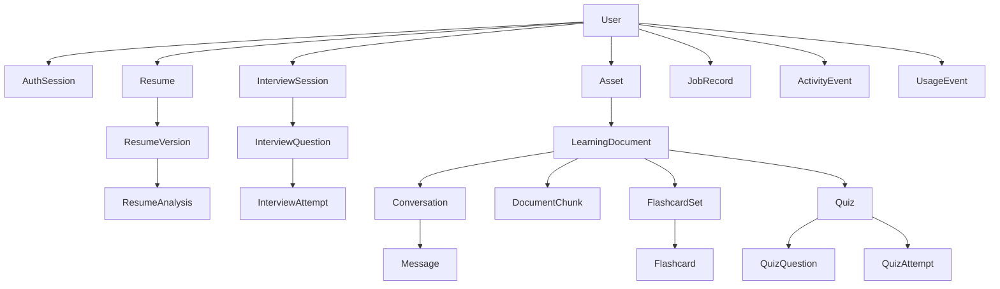

# Career Learning Hub Ownership Map

## Purpose and baseline

This map records the server-enforced ownership relationships at
`da3deb50cdfd2f9130ca0e3ce4fbea1cc08d8a51`. It maps domain resources, not
client routes or UI labels. Ownership is traced from authentication through
route middleware, service queries, parent relationships, storage, jobs, and
tests.

The universal rule is:

> The API derives the user ID from the verified access token and includes that
> user ID in every private-resource query. A client-supplied user ID never
> grants ownership.

Foreign and missing private records normally share the same domain-specific
404 response. Job cancellation intentionally returns a generic 409 when an
owned queued job cannot be matched, so it does not reveal whether a foreign
job exists.

## Authentication root

| Resource | Owner field | Creation | Read/update/delete | Guard and safe behavior | Tests or gap |
| --- | --- | --- | --- | --- | --- |
| User | `_id`, bound to JWT `sub` | Registration creates the user after strict validation; roles and account status are server defaults | `/users/me` uses `request.user`; profile updates assign only four allowlisted profile fields; password change reloads `request.auth.userId` | `authenticate` verifies access-token type, issuer, audience, expiry, active account, and password-change cutoff | Auth integration and mass-assignment tests pass |
| AuthSession | `userId`; JWT `sid` references `_id` | Login/registration create a session with hashed refresh token, random family ID, expiry, and hashed IP | Refresh reads `_id + userId`, compares the hash, rotates it, and checks revocation/expiry; logout revokes the matching session; logout-all/password change update all sessions for `request.auth.userId` | Refresh failures use generic invalid/revoked responses; raw refresh tokens are never stored | Auth integration covers register/login/refresh. `P15-002`: access middleware does not read session revocation. `P15-003`: refresh rotation is not atomic across concurrent contexts |

## Resume domain

| Resource | Owner and parent | Create path | Read/list path | Update/delete path | Private asset and job relationship | Guard, safe foreign behavior, and tests |
| --- | --- | --- | --- | --- | --- | --- |
| Resume | `userId` | `createResume` derives user from controller auth and creates resume/version in one transaction | `listResumes({userId})`; `requireOwnedResume(_id,userId)` for workspace | Design assigns only approved fields; new versions use transaction and optional expected-current-version conflict; no direct delete endpoint | May reference a current owned version; imported resume asset relationship is stored on the version | `requireOwnedResume` returns `RESUME_NOT_FOUND`; ownership-service and cross-user E2E evidence |
| ResumeVersion | `userId + resumeId` | Created with its owned parent in a transaction; version number/current pointer updated atomically | `getOwnedResumeVersion(_id,userId,resumeId)`; list includes both owner and parent | Immutable history through public API; a new version supersedes current; no direct delete | Optional `sourceAssetId` is assigned only from an owned resume-import job | Unique `{resumeId,versionNumber}`; ownership-service test and resume-version index integration test |
| ResumeAnalysis | `userId + resumeId + resumeVersionId` | Worker revalidates owned resume/version, provider output, bullet IDs, and optional unique job ID | `getOwnedAnalysis(_id,userId)`; list first requires owned resume then filters both | Applying rewrites loads resume, analysis, and source version with owner/parent fields in one transaction; no direct delete | Owner-bound analysis job; job payload may contain target role/company/job description | Foreign analysis is `RESUME_ANALYSIS_NOT_FOUND`; source/current-version conflicts are generic 409s; cross-user E2E route coverage |
| Resume recommendation | Embedded in owned ResumeAnalysis; stable suggestion ID and bullet ID | Created only from schema-validated AI output and server-matched source bullet | Returned only through owned analysis | Apply path confirms suggestion belongs to analysis, current resume version matches, and source text is unchanged | No separate asset; parent analysis job provides idempotency | Unknown suggestion is generic validation error; transaction prevents partial rewrite version |

## Interview domain

| Resource | Owner and parent | Create path | Read/list path | Update/delete path | Private data and job relationship | Guard, safe foreign behavior, and tests |
| --- | --- | --- | --- | --- | --- | --- |
| InterviewSession | `userId` | Controller passes authenticated user; optional resume/version references are owner-validated | Middleware loads `_id + userId`; list filters `userId` | Status changes operate on loaded owned session; no delete endpoint | Stores private target role, focus topics, gaps, job description; generation jobs carry `userId + sessionId` | `INTERVIEW_SESSION_NOT_FOUND`; IDOR security and cross-user E2E tests |
| InterviewQuestion | `userId + sessionId` | Manual create uses loaded owned session; AI generation revalidates owner/session and stores in transaction | Middleware requires `_id + sessionId + userId`; lists include owner and parent | Pin and private notes update only the loaded owned question; no delete endpoint | Explanation job binds owner/session/question; notes are never placed in activity metadata | `INTERVIEW_QUESTION_NOT_FOUND`; IDOR security test proves foreign session/question denial |
| InterviewAttempt | `userId + sessionId + questionId` | Recorded from loaded owned session/question; answer length and type are validated | Middleware requires `_id + sessionId + userId`; list filters owner/session and optional question | Feedback worker validates all parent IDs before writing; no delete endpoint | Written answer and feedback are private; feedback job carries owner and all parent IDs | `INTERVIEW_ATTEMPT_NOT_FOUND`; nested route ordering requires session then attempt |
| Interview feedback/explanation | Embedded in owned question/attempt | Generated only through owner-bound jobs and schema/domain validation | Returned only as part of owned parent | Worker updates query with owner and parent identifiers | Provider receives private question/answer content only for requested workflow | Stale/mismatched context is not updated; no direct public entry point |

## Learning and private-asset domain

| Resource | Owner and parent | Create path | Read/list path | Update/delete path | Private asset and job relationship | Guard, safe foreign behavior, and tests |
| --- | --- | --- | --- | --- | --- | --- |
| Asset | `userId` | Authenticated upload validates purpose, MIME, size, magic bytes, quota, and creates a server-built storage key | `getOwnedAsset(_id,userId,status!=deleted)` for metadata/content/signed URL | `deleteOwnedAsset` starts from owned lookup; temporary cleanup is system-owned; metadata promotion starts from owned lookup | Holds the private object key; local HMAC or S3 presigned download is issued only after owner lookup | `ASSET_NOT_FOUND`; private-source and cross-user integration/E2E evidence. `P15-001` affects quota atomicity, not ownership |
| LearningDocument | `userId`; parent Asset by `assetId` | Upload creates owned temporary asset then owned document and processing job | Middleware requires `_id + userId`; list filters owner | Delete changes state, binds deletion job, cancels owner/document jobs, deletes owned asset and all descendants | Private PDF asset must also match owner, purpose, MIME, and optional document metadata; processing/deletion jobs carry owner/document/asset | `LEARNING_DOCUMENT_NOT_FOUND`; source and 22-case deletion-concurrency integration tests |
| DocumentChunk | `userId + documentId` | Processing job inserts after work-fence and owner/document checks | Chunk lists and search include owner/document | Replaced transactionally during processing; deleted in owned document cascade | Derived private document text; never directly public | Parent document middleware precedes list; ownership services and E2E privacy evidence |
| Conversation | `userId + documentId` | Transaction fences owned document before create | Middleware requires `_id + documentId + userId`; list filters both | Message count/last-message update includes owner/document/conversation; deleted in document cascade | Parent for owner-bound messages and chat jobs | `LEARNING_CONVERSATION_NOT_FOUND`; cross-user E2E and deletion concurrency |
| Message | `userId + documentId + conversationId` | User message is transactionally fenced and uniquely keyed by owner/conversation/request ID; assistant response is owner/job-idempotent | List includes all three owner/parent keys and hides internal request/job fields | No direct update/delete; document cascade deletes by owner/document | Stores private chat content; response job carries owner and all parents; source chunk/page IDs are server validated | Parent document and conversation middleware; Phase 14 transaction tests and E2E ownership |
| FlashcardSet | `userId + documentId` | Transaction fences document and uniquely keys owner/document/request ID | Middleware currently requires `_id + userId`; list filters owner and optional document | Generation attaches job and writes cards transactionally; document cascade deletes | Owner-bound generation job; private source-document relationship | `FLASHCARD_SET_NOT_FOUND`; parent document route protects create; list/card service also filters owner |
| Flashcard | `userId + documentId + setId` | Worker validates owned set/document/chunks before transaction insert | Card list filters `userId + setId` | No direct mutation/delete; document cascade deletes owner/document | Derived private content and source page/chunk relationships | Parent set middleware plus service owner filter; E2E foreign-route evidence |
| Quiz | `userId + documentId` | Transaction fences document and uniquely keys owner/document/request ID | Middleware requires `_id + userId`; taking service also requires owner and ready status | Generation attaches job and transactionally replaces questions; document cascade deletes | Owner-bound generation job | `QUIZ_NOT_FOUND` or generic not-ready; E2E ownership and answer-secrecy coverage |
| QuizQuestion | `userId + documentId + quizId` | Worker validates AI indexes, choices, correct index, citations, and inserts transactionally | Taking query filters owner/quiz and selects only prompt, choices, source pages | No public update/delete; generation replaces; document cascade deletes | Correct index and explanation stay server-side until submission/review | Frontend exact-key contracts reject extra answer fields; E2E quiz-secrecy evidence |
| QuizAttempt | `userId + documentId + quizId` | Submission reloads owned ready quiz/questions, validates all indexes, and creates attempt inside document fence transaction | Middleware requires `_id + quizId + userId`; list filters owner and optional parent | Immutable through public API; document cascade deletes | Review joins only owner/quiz questions after successful submission | `QUIZ_ATTEMPT_NOT_FOUND`; Phase 13/14 E2E ownership and answer review |

## Jobs, activity, usage, and quota

| Resource | Owner field | Creation and internal use | Public read/update/delete | Guard and safe behavior | Tests or gap |
| --- | --- | --- | --- | --- | --- |
| JobRecord | optional `userId`; system jobs omit owner | Domain controller constructs type/payload and owner; worker validates payload schema, leases, retries, and applies domain owner checks | `getOwnedJob(_id,userId)`; cancel update requires `_id + userId + queued` | Foreign/missing read is `JOB_NOT_FOUND`; cancel is generic `JOB_NOT_CANCELLABLE`; response omits payload and internal lock fields | Job response and cross-user integration tests; multi-replica lease topology is deferred `D-003` |
| ActivityEvent | optional `userId`; user-visible events include it | Services write narrow identifiers/counts/status metadata; system maintenance may omit user | User activity and Dashboard filter `userId`; no public mutation/delete | Logger redaction protects failure logs; event metadata is size-limited | Dashboard and ownership evidence; no tracked retention policy (`P15-I04`) |
| UsageEvent | required `userId` | AI gateway writes provider/model/count/token/status/latency and narrow IDs, never raw prompt/output | Dashboard aggregates with owner; no direct public mutation/delete | AI usage endpoint reads owner quota; usage log failure sanitizes error | Dashboard tests and AI validation tests; no tracked retention policy (`P15-I04`) |
| AiQuotaCounter | `userId + UTC date` | Atomic conditional increment reserves requests/tokens before provider call | Owner usage endpoint reads current counter; no client mutation | Unique owner/date index and short TTL | Atomic quota logic inspected; provider not called during audit |

## Cross-domain relationship summary

## Ownership invariants by operation

### Creation

- Controllers pass `request.auth.userId`; they never accept an owner ID from
  the body.
- Nested creates start from an already loaded owned parent or re-query the
  parent inside a transaction.
- Worker jobs carry owner IDs assigned by the server, then handlers validate
  those IDs again before domain writes.

### Reads and lists

- Individual reads query both `_id` and `userId`.
- Nested reads add parent IDs such as `resumeId`, `sessionId`, `documentId`,
  `conversationId`, `setId`, or `quizId`.
- Lists always begin with `userId`, adding optional parent filters.
- Job responses exclude raw payloads, and quiz-taking responses exclude
  answer-key fields.

### Updates

- Request validation replaces the original body with parsed/stripped data.
- Controllers or services assign approved fields individually.
- Transactional updates re-check owner and current parent/version/work-fence
  state.
- AI output cannot select arbitrary records; stable references are checked
  against owner-scoped source data.

### Deletes

- Asset deletion starts from an owned asset.
- Learning-document cascade uses owner/document filters for every collection,
  a deletion-job owner, a work fence, queued-job cancellation, and one MongoDB
  transaction for database descendants.
- Resources without an explicit delete endpoint remain until their parent
  cascade or retention mechanism applies.

## Relevant automated evidence

Fresh Phase 15A validation:

- `npm run test:security`: 4/4 files, 7/7 tests passed.
- Auth, cross-user, job-response, private-source, and deletion-concurrency
  integration selection: 5/5 files, 40/40 tests passed.
- Ownership, validation, AI-output, and logger-redaction unit selection:
  4/4 files, 14/14 tests passed.
- API-client, AuthProvider, private-PDF, quiz-contract, and QuizTaker frontend
  selection: 5/5 files, 128/128 tests passed.

Historical approved Phase 14 E2E evidence:

- 21/21 real-browser tests passed across desktop, tablet, and mobile projects.
- Foreign User B received safe unavailable states for User A resources.
- Private PDF presentation and quiz answer secrecy passed.
- Synthetic users, records, files, reports, screenshots, and traces were
  cleaned to zero.

## Unresolved ownership gaps

- `P15-002` is a session-lifecycle gap: the `sid` relationship is not enforced
  during access-token authentication after logout/logout-all.
- `P15-003` is a refresh-lifecycle concurrency gap: two contexts can rotate
  the same current hash without one canonical conditional update.
- Resume and Interview records have no public deletion path, and no tracked
  account-erasure or retention policy covers those private domains or
  Activity/Usage telemetry (`P15-I04`).
- Contributor bus-factor/co-change automation was unavailable. A privacy-safe
  Git count shows one unique author for the application history, but no
  identity is included here.
- No cross-user ownership defect was validated in domain records, private
  storage, job polling, activity, usage, or answer-key handling.
