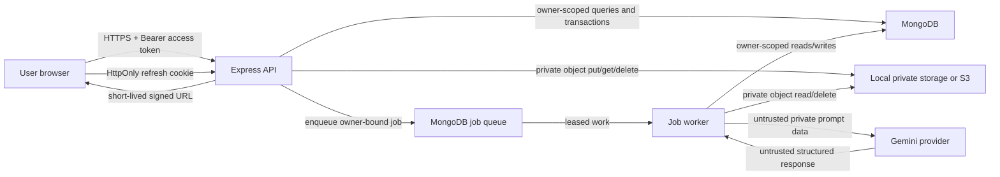

# Phase 15 Security and Privacy Threat Model

## Executive summary

This threat model covers the current Career Learning Hub repository at
`da3deb50cdfd2f9130ca0e3ce4fbea1cc08d8a51`. The application is a React/Vite
browser client backed by an Express/TypeScript API, MongoDB, private local or
S3 object storage, an internal MongoDB-backed job worker, and an optional
Gemini provider boundary.

The highest-value assets are authentication credentials, private resume and
learning content, interview notes and answers, quiz answer keys, private
uploads, and the ownership relationships that bind those records to a user.
The principal security invariant is that every private read or mutation must
derive its user identity from authenticated server state and apply that user
identity at the database or storage boundary.

Current controls are strong around route authentication, strict request
validation, owner-scoped database queries, private object retrieval,
structured AI output, quiz answer secrecy, redacted logging, request IDs,
transactions, idempotency, and deletion fencing. Five bounded findings were
validated:

1. the per-user asset quota check is not atomic across concurrent uploads; and
2. revoking an authentication session does not invalidate an already issued
   access token before its configured short expiry; and
3. concurrent refresh requests can independently rotate the same session,
   weaken one-use replay protection, and leave the browser holding a token
   that the database no longer accepts;
4. production frontend and private-asset origins silently fall back to HTTP
   localhost when explicit configuration is omitted; and
5. public registration reveals whether a personal email already has an
   account.

No unauthenticated compromise, cross-user disclosure, answer-key leak,
arbitrary path access, mass assignment, or secret exposure was validated.
Canonical Codex Security scans and a current online dependency advisory query
were unavailable, so this threat model does not claim complete automated scan
coverage.

## Scope and assumptions

### In scope

- `backend/src`: HTTP entry points, middleware, domain services, models,
  storage, jobs, AI gateway, logging, and error handling.
- `frontend/src`: access-token handling, API calls, response validation,
  private-PDF handling, polling, and answer-key presentation.
- `packages/shared-types`: browser/API contracts.
- `e2e`: synthetic identities, fixtures, runtime configuration, artifacts,
  and cleanup.
- Package manifests, the lockfile, tracked example configuration, and
  security-relevant planning and phase evidence.
- All 317 tracked files were scope-accounted: 153 backend, 116 frontend, 12
  E2E, 27 documentation, 3 shared-package, and 6 top-level files.

### Excluded

- `.git`, installed `node_modules`, editor state, caches, and other vendored or
  generated content.
- The tracked 610-byte synthetic PDF was treated as a fixture binary; its
  location, purpose, size, and cleanup use were reviewed, but its binary
  payload was not treated as application source.
- The prohibited legacy sibling repository.
- Real environment files, production data, production credentials, external
  provider calls, and untracked deployment infrastructure.

### Tracked assumptions

- Production runs behind HTTPS because production client-origin validation
  rejects non-HTTPS non-local origins and production refresh cookies are
  `Secure`.
- MongoDB must support transactions for workflows that use
  `withTransaction`.
- `TRUST_PROXY_HOPS` must match the actual proxy topology.
- Local storage is private to the API process, or S3 bucket policy keeps
  objects private.
- A deployment operator supplies distinct production JWT and asset-signing
  secrets.
- A deployment operator supplies explicit safe production frontend API and
  backend public origins; this assumption is not currently enforced.
- `ENABLE_DEV_ROUTES` remains false in production.

### Unresolved assumptions

- No deployment manifest proves the number of API or worker replicas, the
  uniqueness of `JOB_WORKER_ID`, a distributed rate-limit store, edge
  security headers, CSP, or TLS termination.
- No production S3 policy, lifecycle policy, backup policy, monitoring
  configuration, privacy notice, retention schedule, or incident-response
  runbook is tracked.
- Current online dependency-advisory status could not be established.

## System model

### Primary components

| Component | Responsibility | Trust level |
| --- | --- | --- |
| Browser client | Authentication UI, private workspaces, in-memory access token, validated API rendering | Untrusted execution environment |
| Express API | Authentication, authorization, validation, private-data API, signed access, orchestration | Primary policy enforcement point |
| MongoDB | Users, sessions, owned domain records, jobs, activity, usage, quotas | Trusted persistence boundary |
| Private storage | Local filesystem or S3 private objects | Trusted private-content boundary |
| Job worker | PDF parsing, AI orchestration, domain generation, deletion, cleanup | Privileged internal processor |
| Gemini | Optional remote structured-output provider | External processor; untrusted output |
| E2E harness | Synthetic users, isolated MongoDB/storage, browser artifacts | Test-only privileged tooling |

### Data-flow diagram

### Principal data flows

1. Registration and login validate input, hash passwords, create a stored
   refresh-session record, return an access token, and set a host-only
   HttpOnly refresh cookie.
2. The browser keeps the access token in a React ref, attaches it centrally,
   refreshes through the cookie, deduplicates refresh attempts, and retries an
   unauthorized request once.
3. Domain routers authenticate first, validate request surfaces, then bind
   reads and writes to `request.auth.userId`.
4. Uploads are accepted into memory under size and count limits, validated by
   purpose/MIME/magic bytes, assigned a server-built storage key, and stored
   privately.
5. The API issues owner-authorized, short-lived signed object URLs. The
   browser fetches private PDFs without credentials or referrer and replaces
   the signed URL with a revocable in-memory blob URL.
6. Expensive domain work is stored as an owner-bound job. Workers validate
   payloads again, lease work, and use transactions, idempotency keys, or
   work fences where domain integrity requires them.
7. AI prompts explicitly mark private user content as untrusted. Provider
   output is parsed as JSON, checked against a Zod schema, and subjected to
   domain invariants before storage.
8. Quiz-taking responses select only prompts, choices, and source pages.
   Correct choices and explanations are returned only after a successful
   owner-scoped submission.

## Assets

| Asset | Sensitivity | Security objective |
| --- | --- | --- |
| Passwords and hashes | Critical | Never disclose; strong hashing and validation |
| Access and refresh tokens | Critical | Confidentiality, bounded lifetime, revocation |
| JWT and signing secrets | Critical | Distinct, strong, never logged or committed |
| User profile and email | Personal | Owner-only access and minimal logging |
| Resume content and analyses | Highly private | Owner-only CRUD and provider-bound disclosure |
| Interview notes, attempts, feedback | Highly private | Owner and parent scoped |
| Learning documents, chunks, messages | Highly private | Owner-only access, private storage, safe deletion |
| Quiz answer keys and explanations | Confidential assessment data | Withhold until successful submission |
| Private storage objects and signed URLs | Highly private | Unpredictable, short-lived, no public listing |
| Job payloads and results | Private derived data | Owner-only polling; internal worker access |
| Activity and usage telemetry | Personal metadata | Owner-only reads, redaction, retention governance |
| Request IDs and logs | Operational | Correlation without content or credentials |
| E2E credentials and artifacts | Synthetic but sensitive | Isolated, temporary, never committed |

## Actors and attacker capabilities

### Expected actors

- Anonymous visitor using public authentication and health endpoints.
- Authenticated ordinary user controlling their own account and input.
- Application operator controlling deployment configuration and secrets.
- Internal worker processing queued jobs.
- External AI provider receiving only explicitly constructed prompts.

### Attacker capabilities

- Send arbitrary HTTP methods, headers, JSON, query strings, multipart files,
  and object identifiers.
- Register accounts and coordinate concurrent requests within rate limits.
- Probe whether candidate email addresses have registered accounts.
- Upload crafted files within the configured byte limit.
- Submit prompt-injection content through resumes, documents, job
  descriptions, questions, answers, and notes.
- Learn or guess another user's resource identifiers.
- Obtain a previously valid access token through an independent client-side
  compromise and continue using it after the owner invokes logout.
- Control a service on a user's localhost port when a production deployment
  has silently retained a development origin default.
- Cause browser tests to fail and leave synthetic screenshots or traces in the
  configured external temporary artifact directory.

### Capabilities not assumed

- Direct MongoDB, storage, server filesystem, or process access.
- Knowledge of production signing or JWT secrets.
- Control of the configured allowlisted frontend origin.
- A vulnerability inside MongoDB, Node.js, or a dependency not demonstrated
  by available evidence.

## Trust boundaries and entry points

| Boundary | Entry point | Principal controls |
| --- | --- | --- |
| Internet to API | 74 HTTP handlers across 14 routers | Helmet, exact CORS, rate limits, size limits, validation, normalized errors |
| Public to authenticated API | Bearer token middleware | JWT issuer/audience/type/expiry, active user, password-change cutoff |
| User to owned resource | Path/query/body identifiers | Server-derived user ID, parent-scoped queries, safe 404s |
| Browser to refresh session | Refresh/logout endpoints | HttpOnly Secure-in-production SameSite=Lax cookie, exact CORS, rotation, reuse detection |
| Multipart to storage | Asset, resume, learning uploads | Memory/file/field limits, purpose allowlist, MIME and magic bytes, server key |
| API to local filesystem | Storage adapter | Root resolution, traversal rejection, exclusive create |
| API to S3 | Storage adapter | Private object operations, AES256 upload encryption, presigned reads |
| API to worker | Job records | Schema-validated handler payload, owner-bound job, lease and retry |
| Worker to AI provider | Structured request | Fixed endpoint/provider, timeout, retries, quotas, untrusted delimiters |
| AI output to database/UI | Structured response | JSON/Zod validation, domain invariants, React escaping |
| E2E harness to runtime | Temporary MongoDB/storage/services | Random synthetic credentials, `.test` identities, cleanup hooks |

## Security invariants

1. Client-supplied user IDs never determine ownership.
2. Foreign and missing private resources return equivalent safe responses.
3. Nested resources must match both the authenticated user and their parent.
4. No private object is public merely because its identifier is known.
5. Correct quiz choices and explanations are absent from taking responses.
6. Access tokens are not persisted in browser storage.
7. Refresh tokens are not readable by JavaScript.
8. User content, prompts, answers, documents, and credentials are never
   written to application logs.
9. Provider output is untrusted until structural and domain validation pass.
10. Retried or concurrent jobs cannot write stale learning-document work after
    deletion invalidates the work fence.
11. E2E data is synthetic, isolated, and removed after execution.

## Top abuse paths

### AP-01: Concurrent upload quota bypass

An authenticated attacker submits several valid uploads concurrently. Each
request separately aggregates current usage before any peer request creates
its asset record. Multiple requests can therefore observe the same
below-quota total, write private objects, and cumulatively exceed the account
quota. Authentication, file limits, magic-byte validation, and the global
rate limiter bound the path but do not make quota reservation atomic.

Classification: validated Medium finding `P15-001`.

### AP-02: Reuse of an access token after session revocation

An attacker already holding a valid access token continues calling
authenticated endpoints after the owner logs out or invokes logout-all.
Session records are revoked, but access-token authentication checks the JWT,
active user, and password-change cutoff without reading the referenced
session. The token therefore remains accepted until its configured 5–60
minute expiry, 15 minutes by default.

Classification: validated Low finding `P15-002`.

### AP-03: Cross-user identifier probing

An authenticated attacker substitutes another user's resume, interview,
learning, asset, quiz, attempt, or job identifier. Domain middleware and
services include `userId` and, for nested records, parent IDs in database
queries. Foreign records therefore resolve to the same safe not-found state
as missing records. Security and integration tests passed.

Classification: rejected candidate; controls hold.

### AP-03A: Concurrent refresh rotation

Two browser contexts can share one HttpOnly refresh cookie and bootstrap at
the same time. Both requests can load and validate the same stored token hash,
generate different replacement tokens, and save without a conditional update
or version conflict. If database-save and response-cookie order differ, the
browser can retain the losing token and trigger reuse revocation on its next
refresh. If one racer instead uses a copied token, both requests receive fresh
access tokens before either use is recognized as replay.

Classification: validated Medium finding `P15-003`.

### AP-03B: Production origin fallback to localhost

A production frontend build that omits `VITE_API_URL` silently sends API
traffic to `http://localhost:8000`. The backend likewise defaults
`API_PUBLIC_ORIGIN` to that origin and can construct signed local private-asset
URLs from it. Production environment validation does not reject either
fallback. If the deployment omission occurs and a process controls the user's
local port, credentials, bearer tokens, or short-lived signed capabilities can
reach the wrong origin.

Classification: validated configuration-dependent Medium finding `P15-004`.

### AP-03C: Registration account enumeration

An unauthenticated attacker submits a candidate email to the public
registration endpoint. Existing accounts receive the stable
`EMAIL_ALREADY_REGISTERED` code and message, while unused addresses proceed
to account creation. Per-IP and global limits bound enumeration volume but do
not remove the response oracle.

Classification: validated Low finding `P15-005`.

### AP-04: Private signed-URL leakage

An owner-authorized signed URL is a temporary bearer capability. If copied
while valid, another party could use it. The signature binds the asset and
expiry, issuance is owner-scoped, TTL is 30–3600 seconds and 300 seconds by
default, responses are `private, no-store`, the browser uses `no-referrer`,
and the URL is replaced by a revocable blob URL.

Classification: accepted residual risk inherent to short-lived signed URLs.

### AP-05: Prompt injection through private content

An authenticated user places instructions in a resume, document, job
description, question, or answer. Prompts explicitly delimit these fields as
untrusted; the provider has no tools or direct database access; JSON output is
schema-checked; and domain references, indexes, choices, citations, and
ownership are validated before storage. Generated prose may still be
untrusted content, but React renders it as text and no privileged action is
driven by provider output.

Classification: rejected direct-compromise candidate; residual model-quality
risk remains.

## Threat register

| ID | Threat | Existing controls | Status |
| --- | --- | --- | --- |
| T-01 | Credential stuffing | Generic login error, per-IP login limit, bcrypt | Mitigated; distributed-store assumption remains |
| T-02 | Refresh-token theft/reuse | HttpOnly cookie, rotation, hashed storage, reuse revocation | Mitigated |
| T-03 | Access token after logout | Short TTL, active-user check | `P15-002` |
| T-03A | Concurrent refresh rotation race | Single-context frontend deduplication | `P15-003` |
| T-03B | Production API/public origin falls back to HTTP localhost | Example configuration only | `P15-004` |
| T-03C | Registration account enumeration | Per-IP and global rate limits | `P15-005` |
| T-04 | CSRF on cookie routes | Exact Origin allowlist, SameSite=Lax, cookie path | Mitigated |
| T-05 | IDOR and nested-resource substitution | User and parent fields in queries; safe 404 | Mitigated |
| T-06 | Mass assignment | Parsed request replacement, strict/allowlisted schemas | Mitigated |
| T-07 | File-type spoofing | Purpose/MIME/magic-byte checks | Mitigated |
| T-08 | Path traversal | Server-generated keys and root containment | Mitigated |
| T-09 | Storage resource exhaustion | Byte limits, rate limits, quota | `P15-001` |
| T-10 | Malicious PDF parser exhaustion | Auth, upload limits, queue decoupling within the API process | Deferred validation |
| T-11 | Private asset disclosure | Owner-scoped issue, HMAC/presigned TTL, no-store | Mitigated |
| T-12 | Job-result IDOR | Owner-scoped job query | Mitigated |
| T-13 | Duplicate or stale job writes | Unique idempotency keys, leases, transactions, work fences | Mitigated; multi-replica lease assumption deferred |
| T-14 | Prompt injection | Untrusted delimiters, no tools, schema/domain validation | Mitigated |
| T-15 | Quiz answer-key exposure | Projection excludes answer fields until submission | Mitigated |
| T-16 | Sensitive logs/errors | Key/text redaction, safe error normalization, request IDs | Mitigated |
| T-17 | E2E artifact leakage | Synthetic data, external temp root, cleanup | Informational operational gap |
| T-18 | Vulnerable dependency | Lockfile and local installed graph | Current advisory status unavailable |

## Criticality calibration

- No Critical or High finding was validated.
- `P15-001` is Medium because an authenticated account can realistically
  exceed a server-enforced storage boundary, creating bounded availability or
  cost impact. It does not grant cross-user access.
- `P15-002` is Low because exploitation requires possession of an already
  valid access token and the residual window is short. It is nevertheless a
  demonstrated mismatch between session revocation and access-token
  acceptance.
- `P15-003` is Medium because benign concurrency can force reauthentication
  and a hostile race by an attacker who already stole the refresh token can
  obtain a fresh access token before reuse is recognized. The initial
  credential theft is still a prerequisite, and only one rotated refresh
  token remains canonical.
- `P15-004` is Medium because a realistic production configuration omission
  can route credentials, access tokens, or signed private-asset capabilities
  to a process on the user's localhost. Exploitation requires both the
  operator omission and control of that local port, so it is not High.
- `P15-005` is Low because the unauthenticated response reveals only account
  membership for a supplied email, is rate-limited, and discloses no session
  or private domain data.
- Deployment, dependency, and contributor-concentration observations remain
  informational or coverage limitations until additional evidence makes an
  exploit or policy violation concrete.

## Security-focused review paths

- `backend/src/app.ts`
- `backend/src/config/env.ts`
- `backend/src/config/security.ts`
- `backend/src/middleware/`
- `backend/src/modules/auth/`
- `backend/src/modules/users/`
- `backend/src/modules/assets/`
- `backend/src/modules/resumes/`
- `backend/src/modules/resume-analysis/`
- `backend/src/modules/interviews/`
- `backend/src/modules/learning/`
- `backend/src/modules/ai/`
- `backend/src/modules/activity/`
- `backend/src/modules/progress/`
- `backend/src/jobs/`
- `backend/src/shared/logger.ts`
- `backend/src/shared/mongoTransaction.ts`
- `frontend/src/api/`
- `frontend/src/features/auth/`
- `frontend/src/features/learning/`
- `e2e/`
