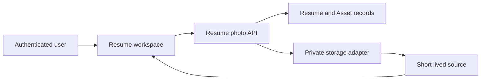

# Phase 19A-4 — Candidate Photo Support Design

## 1. Document authority

- Phase: `19A-4 — Candidate Photo Support`.
- Date: 2026-08-11.
- Status: `HUMAN-APPROVED / FROZEN DESIGN`.
- Approval token: `PHASE_19A4_CANDIDATE_PHOTO_SUPPORT_DESIGN_APPROVED`.
- Token accepted: `YES` (`ACCEPTED / YES`).
- Selected architecture:
  `APPROACH A — BOUNDED EXTENSION OF THE EXISTING PRIVATE ASSET ARCHITECTURE`.
- Phase branch: `phase-19a-4-candidate-photo-support`.
- Baseline: `ad10229aa64cc79b4503901d8b59ac127fac0a20`.
- Baseline subject: `Record Phase 19A-3 merge closeout`.
- Implementation status: `NOT STARTED`.
- Implementation plan: `NOT YET CREATED`.
- Automated verification: `NOT STARTED`.
- Human QA: `NOT STARTED`.

This specification is the self-contained repository transcription of the
human-approved consolidated conversational design and its two approved final
corrections. It is frozen product and architecture authority. The next gate is
human fidelity review of this transcription; implementation planning and
implementation remain separately controlled.

## 2. Scope

Phase 19A-4 adds one optional, user-controlled Candidate Photo to the existing
Resume Studio. It covers local selection, private validation and storage,
Resume-level attachment, replacement, Show, Hide, Remove, current and
historical preview, and native print readiness.

The phase extends the existing authenticated Resume and private Asset systems.
It does not create a new application, storage system, content model, PDF
engine, image-processing service, AI workflow, or account-wide avatar.

## 3. Goals

The future implementation must:

1. let an authenticated Resume owner choose an optional JPEG, PNG, or WebP;
2. reject invalid, excessive, foreign, stale, or unsafe mutations;
3. keep the image private and bound to the owned Resume;
4. distinguish stored attachment identity from visible-on-Resume preference;
5. preserve the old canonical photo until replacement succeeds;
6. render the current Resume-level photo across all three templates and both
   current and historical saved-content surfaces;
7. preserve native `window.print()` export and A4/Letter behavior;
8. keep Candidate Photo out of Resume content versions, recovery, AI, and ATS;
9. preserve unrelated Resume design fields through every photo operation and
   preserve photo identity/visibility through unrelated design operations;
10. add no dependency and no unsupported architectural layer.

## 4. Explicit exclusions

The following are out of scope:

- camera or webcam capture;
- clipboard, remote URL, social-profile, or Gravatar import;
- AI headshots, generation, enhancement, or photo analysis;
- crop, zoom, positioning, filters, beautification, or background removal;
- face detection, landmarks, biometrics, or demographic inference;
- Canvas re-encoding, `sharp`, server transformation, or metadata stripping;
- multiple-photo galleries or historical photo archives;
- account avatars or global profile photos;
- new Resume templates, a new PDF engine, or Resume deletion;
- public image hosting or a second storage mechanism;
- image bytes, base64, or Asset references inside `ResumeContent` or
  `ResumeVersion`;
- OAuth, provider work, unrelated Resume redesign, and Phase 19B+ work.

## 5. Existing architecture retained

The following current boundaries remain authoritative:

- React/Vite frontend and `ResumeWorkspace` orchestration;
- the shared authenticated frontend API client;
- the owned Express Resume router/controller/service/model architecture;
- `Resume` as the owned aggregate for mutable Resume-level presentation state;
- immutable, append-only `ResumeVersion` content snapshots;
- strict frontend response parsing in `resumeContracts.ts`;
- private `Asset` records with `temporary`, `active`, and `deleted` states;
- per-user quota, MIME allowlists, magic-byte checks, safe filenames, and
  checksums;
- local private and S3 private storage adapters selected by the storage factory;
- authenticated and short-lived signed/private source-access mechanisms;
- temporary-Asset cleanup and existing promotion primitives;
- the shared workspace design-mutation lock;
- the three-template registry and safe fallbacks;
- current/historical native `window.print()` architecture.

No existing authentication, ownership, request-ID, no-store, rate-limit,
logging, private-storage, or validation control may be weakened.

## 6. Source-audit findings

The current repository establishes these facts:

- `backend/src/modules/resumes/resume.model.ts` stores `design.showProfilePhoto`
  with default `false`; the same field exists in backend/frontend types,
  validation, service mutation, and frontend parsing.
- `Resume` has no Candidate Photo Asset reference today.
- `ResumeVersion` stores canonical `ResumeContent`; it does not store design or
  Candidate Photo state.
- `frontend/src/features/resumes/resumeRecovery.ts` stores an exact content-only
  envelope and has no photo or design field.
- `ResumeWorkspace.tsx` owns canonical Resume adoption, history selection,
  current/historical previews, print readiness, design saves, page-size saves,
  the shared design-mutation ref, and recovery gates.
- `ResumeWorkspace.tsx` currently forces `showProfilePhoto: false` during page-
  size reconciliation, explicit design-save composition, and unsaved
  template/font/palette preview composition. Those Phase-16 safeguards must be
  removed when Candidate Photo becomes active.
- `ResumeDesignControls.tsx` owns only template/font/palette draft selection and
  does not need to own Candidate Photo state.
- `ResumePreview.tsx` renders the same canonical draft through ATS Classic,
  Modern Professional, and Compact Technical presentation classes.
- `asset.model.ts` already supports private local/S3 objects, user ownership,
  temporary/active/deleted lifecycle, metadata, expiry, and checksums.
- `asset.policy.ts` already provides purpose-specific allowlists/size limits
  and JPEG/PNG/WebP magic-byte recognition, but has no `resume-photo` purpose
  and no raster dimension/pixel policy.
- the generic Asset upload route accepts every purpose exposed by its schema;
  Candidate Photo must not become attachable through that generic route.
- `asset.service.ts` already supplies quota, private storage, promotion,
  deletion, temporary cleanup, and signed-source primitives.
- local and S3 adapters remain private; S3 signed reads use private no-store
  response controls, and local reads resolve beneath a bounded storage root.
- Resume collection cards do not need photo data and must not begin fetching it.

## 7. Legacy findings

The legacy Resume Builder contained profile-photo selection/preview and wrote
profile images through an incompatible mutable/public upload path. Its selector
had weak validation and object-URL cleanup gaps. Its backend, authentication,
token storage, upload route, database model, API client, packages, public
screenshots, and storage behavior remain rejected.

Legacy classification for Candidate Photo is:

`REBUILD / PORT WITH CONTRACT ADAPTATION / FAITHFUL RECREATION`.

Only interaction intent may inform the active feature. No legacy code, route,
model, dependency, public upload, token handling, unknown-provenance asset, or
architecture is copied. The legacy Resume Analyser provides no Candidate Photo
capability to port and does not justify AI or appearance analysis.

## 8. Selected architecture and rejected alternatives

### Selected

Approach A adds a bounded `resume-photo` purpose to the existing private Asset
architecture and one optional Resume-root Asset reference. A dedicated Resume
photo service validates both Resume and Asset association. `ResumeWorkspace`
orchestrates transient source readiness and explicit user operations.

This is the smallest architecture that preserves current authentication,
ownership, storage adapters, cleanup, DTO parsing, Resume-level design, and
native printing.

### Rejected

- Storing bytes or base64 in Resume/ResumeVersion: bloats MongoDB documents,
  couples binary data to content versioning, and violates current boundaries.
- Public object URLs or a permanent S3 URL: leaks private personal data.
- A Candidate Photo collection or second storage system: duplicates Asset
  lifecycle and ownership.
- Account avatar reuse: changes ownership and product semantics.
- Client-only photo state: cannot provide canonical cross-session behavior.
- Full image-processing pipeline: unnecessary for validated original raster
  plus bounded CSS cover rendering.
- Rollback subsystem: temporary staging, CAS, canonical swap, and cleanup are
  sufficient.

## 9. Canonical Candidate Photo data model

Add one optional Resume-root reference equivalent to:

```ts
candidatePhotoAssetId?: ObjectId;
```

The implementation plan must confirm the exact identifier spelling against
current schema conventions, but it must retain this meaning.

The field belongs on `Resume`, not `ResumeContent` or `ResumeVersion`. It
references one owned, active Asset whose purpose is exactly `resume-photo` and
whose association identifies the same Resume. No image bytes, base64, storage
key, signed URL, or metadata is embedded in Resume content.

`design.showProfilePhoto` remains the independent Resume-level visibility
preference. DTOs expose only the optional canonical Asset identifier needed for
mutation/CAS and the existing visibility flag; they never expose storage keys,
checksums, provider credentials, or permanent source URLs.

## 10. Resume/Asset ownership

Every Candidate Photo operation derives user identity from authenticated server
state and requires an owned Resume query. A supplied or existing Asset must:

- belong to the same authenticated user;
- have purpose `resume-photo`;
- be in the expected temporary/active state for the operation;
- be associated only with the target Resume;
- match the current Resume reference when used as a CAS expectation.

Missing and foreign Resumes/Assets retain ownership-safe not-found behavior.
Client-supplied user IDs are forbidden. The generic Asset endpoint must not
accept `resume-photo`; only the dedicated owned Resume upload flow may create
and attach this purpose.

## 11. Visibility-state model

The canonical states are:

| State | `candidatePhotoAssetId` | `showProfilePhoto` | Result |
| --- | --- | --- | --- |
| No photo | absent | `false` | no photo is stored or rendered |
| Stored but hidden | present | `false` | private photo retained, not rendered |
| Stored and shown | present | `true` | canonical private photo rendered when ready |

`candidatePhotoAssetId` absent with `showProfilePhoto: true` is invalid. Future
validation/service logic must reject or safely normalize it to hidden; clients
must never render or print a photo from that state.

No template, AI action, role, country, industry, or default automatically
enables a photo.

## 12. Upload source and UI entry point

Phase 19A-4 accepts local file selection only through a native file input. The
bounded `ResumeCandidatePhotoControls` UI is presented in the existing Resume
workspace/editor flow near candidate Basics/presentation controls while
`ResumeWorkspace` remains the canonical operation owner.

The UI supports:

- Choose photo;
- Replace photo;
- Show on Resume;
- Hide from Resume;
- Remove photo.

It provides concise neutral guidance: Candidate photos are optional and Resume
conventions vary by country and employer. It makes no hiring, ATS, legal, or
industry promise.

## 13. File formats

Allowed declared MIME types:

- `image/jpeg`;
- `image/png`;
- `image/webp`.

`image/svg+xml` and every other type are rejected. SVG is excluded to avoid
unnecessary active-content and parsing complexity. Filename extensions alone
are never authoritative.

## 14. Size, dimension, and pixel bounds

Authoritative server limits are:

- maximum encoded size: `2 MiB` (`2 * 1024 * 1024` bytes);
- maximum width: `4096` pixels;
- maximum height: `4096` pixels;
- maximum total decoded pixel count: `16,000,000` pixels.

Width and height must be positive. Multiplication must be overflow-safe. The
server uses bounded format-aware header parsing plus signature validation; it
must reject malformed, missing, contradictory, or excessive dimension data.
This bounded parsing is not represented as a complete raster decode.

Frontend checks provide early guidance only and never replace server checks.

## 15. Native local decode preflight

Before initial upload or replacement, the frontend performs this
dependency-free lifecycle on the exact selected `File`:

1. capture the selected File and active selection generation;
2. apply bounded MIME and encoded-size guidance;
3. create one temporary local object URL;
4. decode the exact file with `HTMLImageElement.decode()` or the smallest
   dependency-free native equivalent supported by the actual runtime;
5. optionally inspect `naturalWidth`/`naturalHeight` for early bounded feedback;
6. revoke the temporary local object URL unconditionally in success, failure,
   cancellation, and obsolete-selection paths;
7. confirm that the decoded File is still the active selection;
8. submit only that same successfully decoded active File.

Decode failure shows a safe local error and sends no upload request. During a
replacement it leaves the old canonical attachment, visibility, design, and
private source untouched.

The File, bytes, blob, local object URL, dimensions, EXIF metadata, and
temporary selection identity remain transient memory only. None may enter
sessionStorage, localStorage, IndexedDB, recovery, logs, analytics, or a
canonical print source.

This preflight is a usability guard, not a security authority.

## 16. Authoritative backend validation

The backend independently enforces, regardless of frontend success:

- authentication and owned Resume lookup;
- dedicated Candidate Photo route and `resume-photo` purpose;
- declared MIME allowlist and SVG rejection;
- magic-byte validation;
- 2 MiB encoded-size limit;
- positive bounded width/height and 16 MP total-pixel limit;
- applicable per-user private Asset quota;
- safe filename normalization;
- temporary staging and valid Asset state;
- same-user Asset ownership and same-Resume association;
- expected-current-attachment CAS;
- canonical replacement/removal and cleanup rules.

A malicious client that bypasses local decode gains no advantage. Frontend
decode success cannot weaken any server control.

## 17. Image processing decision

Store the original validated raster. Render it inside one bounded portrait
frame using CSS equivalent to `object-fit: cover`.

Do not crop, transform, resize, re-encode, beautify, filter, enhance, detect
faces, inspect landmarks, remove backgrounds, or add image-processing
dependencies/services. Client and server must not create a derived canonical
image.

## 18. Metadata/EXIF privacy

Because the original raster is retained, embedded metadata may remain in the
private object. The product and documentation must state this truthfully and
must not claim EXIF stripping.

Phase 19A-4 does not add tooling solely to remove metadata. Privacy is instead
bounded through optional user choice, private storage, limited formats/size,
no third-party photo processing, no AI transfer, no permanent public URLs, no
persistent browser copy, and explicit Remove.

## 19. Private storage and source access

Local and S3 objects remain private. Never expose raw local paths, storage
keys, permanent S3 URLs, credentials, tokens, or secrets.

The dedicated owned Resume source operation is:

```text
GET /api/v1/resumes/:resumeId/candidate-photo/source
```

Before returning a short-lived source descriptor it validates the authenticated
Resume owner, current Resume attachment, Asset owner, purpose, active state,
and same-Resume association. It may reuse existing signed/private Asset access
internally; generic Asset ownership alone is not sufficient for this relation.

The frontend requests the short-lived target only when a workspace preview or
print surface needs the canonical photo. It then fetches the bytes with
credentials omitted for the signed target, no referrer, and no-store behavior;
validates the bounded response; creates an in-memory blob object URL; decodes
that canonical source; and revokes it on replacement, removal, route change,
logout, or unmount.

The signed URL is never used as persistent Resume state, inserted into recovery,
logged, or exposed as a permanent DOM source. A signed/network failure is a
retriable source-access failure.

## 20. Temporary Asset staging

Candidate Photo upload creates a private `resume-photo` Asset in the existing
temporary state with bounded expiry. It becomes active only after the owned
Resume association succeeds. Failed or abandoned objects remain cleanup-
eligible under existing bounded temporary cleanup semantics.

Generic upload cannot select `resume-photo`. This prevents callers from
creating unattached Candidate Photo objects outside the Resume association
workflow.

## 21. Initial upload lifecycle

The dedicated operation is:

```text
POST /api/v1/resumes/:resumeId/candidate-photo
```

It accepts one multipart File plus a strict CAS representation of the expected
no-photo state. The exact transport representation is finalized in the future
implementation plan; it must distinguish explicit expected absence from a
missing precondition and accept no user ID.

Lifecycle:

1. local File checks and native decode succeed;
2. acquire the shared synchronous mutation/single-flight lock;
3. upload to the owned Resume endpoint;
4. server validates Resume, File, quota, and expected attachment state;
5. create one temporary private Asset;
6. atomically associate and activate it under CAS;
7. set `showProfilePhoto: true` because initial upload is upload-and-show;
8. return the canonical Resume response;
9. fetch and decode the canonical private source for display readiness.

Failure before canonical association produces no false success and leaves the
Resume in the no-photo state. Temporary cleanup owns any unattached object.

## 22. Replacement lifecycle

Replacement uses the same POST route and supplies the expected current
Candidate Photo identity as its CAS precondition.

The old photo remains canonical while local decode, upload, validation, and
association are pending. Replacement preserves the existing visibility value:
a hidden photo stays hidden and a visible photo stays visible.

On successful CAS association:

- the new Asset becomes active and canonical;
- the Resume points only to the new Asset;
- the old Asset becomes non-canonical and cleanup-eligible through the bounded
  Asset lifecycle;
- best-effort immediate cleanup may run, with existing batch cleanup retaining
  responsibility if physical deletion fails;
- the canonical response replaces workspace state;
- the new private source is fetched and decoded before display/print readiness.

Local decode failure, backend validation rejection, upload failure, and stale
CAS rejection leave the old canonical photo completely untouched.

## 23. Show and Hide semantics

Show and Hide are explicit Resume-level visibility mutations through the
existing owned design path or its smallest purpose-specific frontend wrapper.

- Show patches only `showProfilePhoto: true` and is allowed only when the
  Resume has a valid canonical Candidate Photo.
- Hide patches only `showProfilePhoto: false`; it retains the Asset and
  `candidatePhotoAssetId`.

Neither action changes Asset identity, Resume content/version, template,
palette, font, or page size. Failures preserve canonical state and use safe,
request-ID-aware errors where supported.

## 24. Removal lifecycle

The dedicated operation is:

```text
DELETE /api/v1/resumes/:resumeId/candidate-photo
```

It supplies the expected current Candidate Photo identity using a strict CAS
contract finalized in the implementation plan.

Successful Remove:

- clears `candidatePhotoAssetId`;
- sets `showProfilePhoto: false`;
- preserves template, palette, font, page size, current version, and content;
- makes the old Asset non-canonical and cleanup-eligible;
- performs or schedules bounded private-object deletion;
- creates no `ResumeVersion`.

The user confirms Remove through the existing accessible `Dialog`. Failure
before the canonical transaction leaves the photo attached. A post-commit
physical cleanup failure is reported truthfully without claiming the Asset is
still canonical; the persisted cleanup-eligible state remains recoverable by
bounded cleanup.

## 25. Design-mutation isolation correction

The frozen invariant is:

`UNRELATED RESUME DESIGN MUTATIONS MUST PRESERVE THE CANONICAL CANDIDATE-PHOTO
VISIBILITY PREFERENCE.`

Future implementation removes the three historical `showProfilePhoto: false`
overrides from `ResumeWorkspace.tsx` and enforces:

- template save preserves canonical visibility;
- font save preserves canonical visibility;
- palette save preserves canonical visibility;
- A4/Letter save preserves canonical visibility;
- unsaved template/font/palette preview preserves canonical visibility;
- page-size and design reconciliation use server-returned visibility;
- design requests never change `candidatePhotoAssetId`;
- photo requests never change template, palette, font, or page size;
- only upload-and-show, Show, Hide, and Remove may change visibility.

`ResumeWorkspace` remains the orchestration boundary. `ResumeDesignControls`
does not acquire Candidate Photo state solely for this correction.

## 26. Concurrency, CAS, and single-flight

Reuse the existing synchronous workspace design-mutation ref for photo and
design operations. Duplicate clicks/submissions are single-flight and relevant
controls are disabled while a mutation is pending. Do not add a concurrency
framework.

Every identity-changing upload, replacement, or removal includes the caller's
expected current attachment state. The backend compares it within the canonical
mutation boundary and returns a safe conflict when stale. An older selection or
response cannot overwrite a newer attachment.

Local selection uses a monotonically changing identity/generation so delayed
decode completion for an obsolete File cannot submit. Source-fetch results are
also ignored/revoked when the route, attachment, or user changes.

## 27. Immutable ResumeVersion interaction

Candidate Photo is mutable Resume-level attachment/presentation state. Choose,
upload, replace, Show, Hide, Remove, source-readiness, and design changes create
no immutable `ResumeVersion`.

Existing Save New Version remains reserved for canonical `ResumeContent`
changes. Candidate Photo never enters Version content, metadata, source Asset
identity, change summary, diff, or version-number behavior.

## 28. Phase 19A-3 recovery interaction

The Phase 19A-3 recovery schema and writer remain structurally unchanged.
Recovery stores only unsaved canonical `ResumeContent` plus its existing
identity/version/timestamp envelope.

Never persist in recovery:

- File, bytes, Blob, local object URL, or signed URL;
- dimensions or image metadata;
- `candidatePhotoAssetId`, Asset ID, storage key, or source descriptor;
- photo visibility, operation state, credentials, or secrets.

Photo mutations are independently server-persisted and disabled while a
recovery decision gate makes the workspace read-only. Recovery restore/discard
does not roll photo state backward or forward.

## 29. Current and historical Resume behavior

Historical `ResumeVersion` records remain immutable content snapshots. Current
and historical rendering combine:

```text
selected saved ResumeContent
+ current Resume-level design
+ current Resume-level Candidate Photo attachment and visibility
```

No historical photo preservation or archive is claimed. Replacing, hiding, or
removing the current Candidate Photo changes the visual photo state for both
current and historical content surfaces without mutating any version.

Read-only stale recovery likewise contains no historical photo; if its preview
uses the current design surface, any photo shown is explicitly current
Resume-level state, never recovered content.

## 30. Template behavior

ATS Classic, Modern Professional, and Compact Technical all support an optional
Candidate Photo. All continue to render the same canonical Resume draft and
section order. No template requires or automatically enables the image.

One reusable bounded photo-rendering treatment supplies the decoded canonical
source to the templates. Each layout keeps the portrait near the candidate
identity/header without changing semantic content order. No-photo and hidden
states preserve current layout behavior. Long names, contact details, links,
and multipage content must remain contained and readable.

## 31. A4/Letter and native print/export

Preserve `window.print()`, print-only Resume surfaces, document-title filename
hints, A4/Letter page-size control, current/historical selection, and existing
print CSS architecture. Add no PDF dependency or backend export route.

When visibility is false or no attachment exists, print readiness follows the
existing path. When visibility is true, print is ineligible until the canonical
private source is fetched and successfully decoded. The UI reports loading or
retriable failure truthfully; it never prints a temporary local selection as
saved canonical state.

Required combinations are current A4, current Letter, historical A4, and
historical Letter across all three templates.

## 32. AI and ATS exclusion

Candidate Photo has zero effect on Resume assessment, ATS or formatting scores,
keywords, rewriting, text extraction, suggestions, employment recommendation,
or Gemini prompts/payloads.

The image, URL, Asset ID, metadata, dimensions, and visibility are excluded
from AI requests and analysis persistence. The system performs no appearance,
biometric, gender, age, race/ethnicity, attractiveness, emotion, or hiring-
suitability analysis.

## 33. Accessibility

The future UI preserves:

- native file-input semantics and keyboard operation;
- meaningful Choose, Replace, Show, Hide, and Remove names;
- visible focus and usable touch targets;
- associated optionality/format/size guidance;
- safe validation, busy, success, and failure announcements;
- non-color-only state meaning;
- accessible confirmation with focus return for Remove;
- reduced-motion behavior;
- an empty alternative (`alt=""`) for the portrait when the nearby Resume name
  already identifies the candidate, with no duplicate candidate-name label or
  announcement.

The image is presentation associated with already visible identity, not a new
content section. It must not become a labelled content region or replace the
visible text identity. These semantics are verified with assistive-name
assertions.

## 34. Responsive and 200% behavior

The UI and portrait frame must wrap without horizontal overflow and preserve
preview/print geometry at minimum:

- desktop `1440 × 900`;
- tablet `768 × 1024`;
- mobile `390 × 844`;
- actual Chrome 200% zoom.

Controls may stack, but remain understandable and keyboard/touch operable.
The photo remains bounded; candidate identity and contact content reflow rather
than clip. Print page dimensions remain independent of viewport reflow.

## 35. Failure and error states

The future implementation handles:

- unsupported/SVG/wrong MIME and magic-byte mismatch;
- empty or >2 MiB input;
- excessive/malformed dimensions or pixel count;
- corrupt or locally undecodable JPEG/PNG/WebP;
- obsolete local selection;
- failed upload, backend rejection, or quota failure;
- failed/stale replacement while preserving the old photo;
- failed Show/Hide while preserving canonical visibility;
- failed Remove or post-commit cleanup debt represented truthfully;
- signed/private source fetch, canonical MIME/size, network, or decode failure;
- foreign/missing Resume or Asset and mismatched association;
- stale/CAS mutation and duplicate submission;
- deleted or unavailable Resume.

Errors are concise, provider-neutral, privacy-safe, and request-ID-aware where
the current API supplies an ID. They do not disclose ownership, paths, keys,
signatures, filenames beyond safe user display, raw exceptions, or image data.

## 36. Security threat model

### Scope and assumptions

Runtime scope is the authenticated Resume workspace, Resume Candidate Photo
routes/service/model, private Asset policy/lifecycle, local/S3 storage adapters,
and source-readiness flow. CI, deployment changes, production secrets, public
scale, and unrelated modules are out of scope. The existing authenticated
academic-MVP deployment and per-user ownership model are retained assumptions.

### Assets and trust boundaries

- Assets: private candidate image bytes and metadata (confidentiality), Resume
  attachment/visibility/design state (integrity), storage quota and processing
  capacity (availability), signed targets and credentials (confidentiality).
- Browser → Resume API: untrusted multipart File, route ID, CAS state, and
  visibility actions cross authenticated HTTP with schema/rate-limit controls.
- Resume service → MongoDB/Asset lifecycle: owned relation and atomic canonical
  state cross the persistence boundary.
- Asset lifecycle → local/S3 storage: validated private bytes and opaque storage
  keys cross adapter boundaries.
- Resume API → signed target → browser Blob: short-lived source authority and
  private image bytes cross a time-bounded read boundary.



### Attacker model

A realistic attacker may be an unauthenticated caller, an authenticated user
attempting cross-user access, or a malicious client bypassing frontend checks
and submitting crafted files, identifiers, repeated requests, or stale state.
The model does not assume database, server filesystem, cloud credential, or
operator access.

### Prioritized threats and mitigations

| ID | Abuse path | Likelihood / impact / priority | Required controls and evidence anchors |
| --- | --- | --- | --- |
| TM-001 | User supplies another Resume or Asset ID to read/replace/remove a photo. | Medium / High / High | Derive user ID from auth; bind Resume, Asset owner, purpose, state, and association; retain safe 404s. Anchors: `resume.service.ts::requireOwnedResume`, `asset.service.ts::getOwnedAsset`. |
| TM-002 | Crafted declared MIME hides SVG or different bytes. | Medium / High / High | Dedicated allowlist, SVG rejection, magic bytes, canonical response MIME checks. Anchor: `asset.policy.ts::validateAssetFile`. |
| TM-003 | Small encoded file declares abusive dimensions/pixels or malformed headers. | Medium / High / High | 4096-side/16 MP limits, bounded parsers, 2 MiB cap, rate limits, no server raster transform. |
| TM-004 | Stale replacement/removal overwrites a newer photo. | Medium / Medium / Medium | Expected-current-attachment CAS, shared single-flight lock, obsolete-selection generation, transactionally guarded association. |
| TM-005 | Generic upload creates unassociated `resume-photo` objects and consumes quota. | Medium / Medium / Medium | Exclude purpose from generic upload schema; dedicated owned Resume route; temporary expiry and quota. Anchors: `asset.schemas.ts`, `asset.service.ts::assertAssetQuota`. |
| TM-006 | Permanent/public/signed URL leaks private candidate data. | Low / High / Medium | Dedicated relation-validated source, short TTL, private no-store, no-referrer fetch, in-memory Blob URL, no persistence/logging. Anchors: `asset.service.ts::createSignedAssetUrl`, private storage adapters. |
| TM-007 | Malicious filename causes path or response injection. | Low / Medium / Low | Opaque generated storage key, basename/control-character normalization, never derive storage path from filename. Anchor: `asset.service.ts::safeOriginalFilename`. |
| TM-008 | Failed association/replacement leaves orphaned private objects. | Medium / Medium / Medium | Temporary staging, expiry, cleanup job, post-swap retirement, best-effort immediate deletion with batch fallback. |
| TM-009 | Image bytes, metadata, signed URLs, or identifiers leak through recovery/logs/AI. | Low / High / Medium | Content-only exact recovery envelope, no body/image logging, no AI payload inclusion, static privacy/secret scans. Anchors: `resumeRecovery.ts`, root logging rules. |
| TM-010 | Duplicate uploads or source generation exhaust memory/storage. | Medium / Medium / Medium | 2 MiB Multer/policy cap, quota, dedicated rate limit, single-flight, bounded reads, revoke Blob URLs, avoid list-card fetches. |

Residual risks are bounded but explicit: the original private raster may retain
EXIF metadata; header validation is not a full server decode; browser/source
decode can still fail after canonical success and must be retriable; signed
targets are bearer capabilities until expiry. These do not authorize public
exposure, validation weakening, or new processing infrastructure.

Manual security review focuses on `backend/src/modules/resumes/`,
`backend/src/modules/assets/`, `backend/src/middleware/rateLimit.ts`,
`frontend/src/features/resumes/resumeCandidatePhoto.ts`, API parsing, recovery,
and changed tests.

## 37. Backward compatibility and migration

Existing Resumes remain valid with `candidatePhotoAssetId` absent and the
existing `showProfilePhoto: false` default. The new reference is optional and
additive. No destructive or backfill migration, generated photo, placeholder
Asset, or default visibility change is needed.

If legacy data contains `showProfilePhoto: true` without a valid attachment,
the effective state is safely hidden and future mutation validation
normalizes/rejects the invalid combination. Legacy `includePhoto` mappings do
not create an Asset reference.

## 38. Performance

Candidate images are bounded to 2 MiB, 4096 pixels per side, and 16 MP. Fetch
only within the active Resume workspace/preview/print surfaces. Do not fetch
photos for Resume collection cards, unrelated pages, AI, or ATS.

Reuse a valid in-memory canonical source for the mounted attachment where safe;
avoid repeated signed-source generation. Revoke all object URLs. Avoid image
transforms, workers, prefetch, and unrelated caching infrastructure.

## 39. Privacy and user guidance

Candidate Photo is optional and controlled by Choose, Show, Hide, Replace, and
Remove. Guidance is neutral and explains that conventions vary by country and
employer. It does not assert better hiring outcomes, ATS performance,
recruiter preference, industry convention, or legal necessity.

Data minimization rules:

- one current photo per Resume;
- no gallery/history/global avatar;
- no third-party or AI transfer;
- no persistent browser copy or recovery entry;
- no collection-card fetch;
- no image/metadata logging;
- private storage and explicit removal;
- truthful disclosure that original metadata may remain.

## 40. Exact future file map

No implementation occurs under this specification. The future implementation
plan must start from this source-backed map and remove a proposed modification
if TDD proves it unnecessary; it must not invent a new layer for convenience.

### Frontend

| Classification | Path | Future responsibility |
| --- | --- | --- |
| CREATE | `frontend/src/features/resumes/ResumeCandidatePhotoControls.tsx` | Native selection and explicit Choose/Replace/Show/Hide/Remove UI. |
| TEST / CREATE | `frontend/src/features/resumes/ResumeCandidatePhotoControls.test.tsx` | Interaction, busy/error, keyboard, visibility, and removal-confirmation coverage. |
| CREATE | `frontend/src/features/resumes/resumeCandidatePhoto.ts` | File guidance, native decode preflight, selection generation, canonical source fetch/decode, Blob URL lifecycle. |
| TEST / CREATE | `frontend/src/features/resumes/resumeCandidatePhoto.test.ts` | MIME/size/decode/revocation/obsolete-selection/source-readiness/recovery-exclusion coverage. |
| MODIFY | `frontend/src/features/resumes/ResumeWorkspace.tsx` | Canonical photo state/readiness, operations, shared lock, print gate, current/historical wiring, remove forced-false behavior. |
| TEST / MODIFY | `frontend/src/features/resumes/ResumeWorkspace.test.tsx` | Lifecycle, isolation correction, CAS/single-flight, history, recovery, and print-readiness tests. |
| MODIFY | `frontend/src/features/resumes/ResumeEditor.tsx` | Small Candidate Photo controls integration at the existing candidate Basics boundary without owning persistence. |
| TEST / MODIFY | `frontend/src/features/resumes/ResumeEditor.test.tsx` | Bounded integration/accessibility regression coverage. |
| MODIFY | `frontend/src/features/resumes/ResumePreview.tsx` | Optional decoded canonical portrait treatment for all templates. |
| TEST / MODIFY | `frontend/src/features/resumes/ResumePreview.test.tsx` | Three-template/no-photo/hidden/visible/long-content/accessibility coverage. |
| MODIFY | `frontend/src/features/resumes/ResumeRecoveryReview.tsx` | Truthful current Resume-level photo wiring where the current design preview is reused; no recovery persistence. |
| TEST / MODIFY | `frontend/src/features/resumes/ResumeRecoveryReview.test.tsx` | Prove photo remains outside recovery and review stays read-only/non-exportable. |
| MODIFY | `frontend/src/features/resumes/resumeApi.ts` | Dedicated upload/source/remove operations and smallest visibility wrapper using the shared client. |
| TEST / MODIFY | `frontend/src/features/resumes/resumeApi.test.ts` | Exact routes, auth, multipart/CAS, identity validation, and no private-field exposure. |
| MODIFY | `frontend/src/features/resumes/resumeContracts.ts` | Strict optional Candidate Photo identifier/source descriptor parsing. |
| TEST / MODIFY | `frontend/src/features/resumes/resumeContracts.test.ts` | Absent/valid/invalid identifier and strict source response tests. |
| MODIFY | `frontend/src/features/resumes/types.ts` | Resume-level optional identifier and bounded source/readiness types. |
| MODIFY | `frontend/src/features/resumes/resumeWorkspace.css` | Bounded portrait, controls, responsive, focus, and print styles. |
| REUSE / READ-ONLY | `frontend/src/features/resumes/ResumeDesignControls.tsx` | Existing template/font/palette selection; no photo ownership. |
| REUSE / READ-ONLY | `frontend/src/features/resumes/resumeRecovery.ts` | Content-only recovery envelope remains unchanged. |
| REUSE / READ-ONLY | `frontend/src/features/resumes/resumeRecoveryWriter.ts` | Existing content-only writer remains unchanged. |
| REUSE / READ-ONLY | `frontend/src/features/resumes/resumeTemplateRegistry.ts` | Existing three-template identifiers and safe fallbacks. |
| REUSE / READ-ONLY | `frontend/src/features/resumes/resumePrint.ts` | Native print/title behavior remains unchanged. |
| REUSE / READ-ONLY | `frontend/src/features/resumes/ResumePrintControls.tsx` | Existing print controls consume expanded readiness only through workspace props. |
| REUSE / READ-ONLY | `frontend/src/components/Dialog.tsx` | Existing accessible Remove confirmation. |
| REUSE / READ-ONLY | `frontend/src/api/apiClient.ts` | Existing authenticated API and request-ID normalization. |

### Backend

| Classification | Path | Future responsibility |
| --- | --- | --- |
| CREATE | `backend/src/modules/resumes/resumePhoto.service.ts` | Owned upload/staging, relation checks, CAS association/replacement/removal, visibility invariants, source descriptor, retirement/cleanup coordination. |
| MODIFY | `backend/src/modules/resumes/resume.model.ts` | Optional Resume-root Candidate Photo Asset reference. |
| MODIFY | `backend/src/modules/resumes/resume.types.ts` | Resume-level optional identifier typing; no ResumeContent/Version change. |
| MODIFY | `backend/src/modules/resumes/resume.validation.ts` | Strict photo mutation/CAS parameters and invalid visibility-state guard. |
| MODIFY | `backend/src/modules/resumes/resume.service.ts` | Preserve/normalize Resume aggregate invariants and prevent unrelated design mutation. |
| MODIFY | `backend/src/modules/resumes/resume.controller.ts` | Dedicated upload/source/remove controllers with authenticated identity. |
| MODIFY | `backend/src/modules/resumes/resume.routes.ts` | Dedicated routes, bounded multipart handling, validation, and rate limit. |
| MODIFY | `backend/src/modules/assets/asset.model.ts` | Add bounded `resume-photo` purpose. |
| MODIFY | `backend/src/modules/assets/asset.policy.ts` | 2 MiB MIME/magic/dimension/pixel rules for `resume-photo`. |
| MODIFY | `backend/src/modules/assets/asset.schemas.ts` | Keep `resume-photo` out of generic upload-purpose input. |
| REUSE / READ-ONLY | `backend/src/modules/assets/asset.service.ts` | Existing quota, create, promotion, signed target, deletion, and cleanup primitives. |
| REUSE / READ-ONLY | `backend/src/modules/assets/asset.signing.ts` | Existing bounded local signatures. |
| REUSE / READ-ONLY | `backend/src/modules/assets/storage/local.storage.ts` | Existing private local adapter. |
| REUSE / READ-ONLY | `backend/src/modules/assets/storage/s3.storage.ts` | Existing private S3 adapter and signed reads. |
| REUSE / READ-ONLY | `backend/src/modules/assets/storage/storage.factory.ts` | Existing provider selection. |
| REUSE / READ-ONLY | `backend/src/modules/assets/storage/storage.types.ts` | Existing private adapter contract. |
| MODIFY | `backend/src/middleware/rateLimit.ts` | Bounded Candidate Photo upload/mutation limiter using existing conventions. |
| TEST / CREATE | `backend/src/tests/integration/resumeCandidatePhoto.integration.test.ts` | Full owned lifecycle, CAS, association, visibility, cleanup, history/version, source, and failure tests. |
| TEST / CREATE | `backend/src/tests/security/resumeCandidatePhoto.security.test.ts` | Cross-user, spoofing, public leakage, malformed input, mass-assignment, and logging boundaries. |
| TEST / MODIFY | `backend/src/tests/integration/resumeDesign.integration.test.ts` | Design/photo isolation and invalid visibility-state regression. |
| TEST / MODIFY | `backend/src/tests/integration/crossUserAccess.integration.test.ts` | Foreign Resume/Asset/source access regression. |
| TEST / MODIFY | `backend/src/tests/unit/storageAdapters.test.ts` | Purpose MIME/magic/size/dimension/pixel and private adapter regressions. |
| TEST / MODIFY | `backend/src/tests/security/rateLimitBypass.security.test.ts` | Candidate Photo limiter bypass resistance. |
| TEST / MODIFY | `backend/src/tests/security/massAssignment.security.test.ts` | Reject user ID, storage fields, and unrelated Resume mutation. |

`packages/shared-types/` remains unchanged because current Resume contracts are
module-local. No package, lockfile, environment, provider, app mount, migration,
or new top-level module is planned.

## 41. Future TDD matrix

Implementation uses test-driven development later; these tests are not run or
written during design transcription.

### File validation

- JPEG, PNG, and WebP accepted.
- SVG, unsupported/wrong MIME, and magic mismatch rejected.
- Empty and >2 MiB rejected.
- Width >4096, height >4096, and >16 MP rejected.
- Malformed or contradictory dimension headers rejected.

### Local decode

- Undecodable JPEG/PNG/WebP each produce a safe error and zero upload calls.
- Temporary local object URL revoked on success and failure.
- Obsolete delayed selection cannot upload.
- Valid local decode does not bypass backend rejection.

### Ownership and source

- Owned Resume accepted; foreign/missing Resume rejected safely.
- Foreign, wrong-purpose, deleted, or mismatched Asset rejected.
- Cross-user source rejected; response omits storage/private fields.
- Signed/network/canonical decode failure remains retriable and blocks photo-
  enabled print.

### Upload and replacement

- Initial upload becomes canonical and shown.
- Failure produces no false success; duplicate submission is single-flight.
- Replacement success changes identity and preserves hidden/visible preference.
- Local decode failure/backend rejection/stale CAS preserves old canonical photo.
- Successful swap retires old Asset through bounded cleanup.

### Show, Hide, and Remove

- Show and Hide change only visibility; hidden Asset remains stored.
- Show without a valid attachment is rejected/normalized safely.
- Remove clears identity and visibility and preserves template/palette/font/page.
- Failed Remove remains truthful and creates no ResumeVersion.

### Design-mutation correction

- Visible photo + Save design remains visible.
- Hidden uploaded photo + Save design remains hidden.
- Visible photo + A4→Letter remains visible.
- Hidden uploaded photo + paper change remains hidden.
- Unsaved template/font/palette preview preserves canonical visibility.
- Reconciliation preserves server-returned visibility.
- Template/font/palette/page-size mutation never changes photo identity.
- Photo mutation never changes unrelated design fields.
- Shared lock prevents cross-overwrite.

### Recovery, templates, print, and AI

- No File, bytes, Blob/object/signed URL, dimensions, metadata, Asset ID, or
  Candidate Photo state enters recovery; its exact envelope is unchanged.
- ATS Classic, Modern Professional, Compact Technical support no/hidden/visible
  photo and stable long content.
- Current/historical A4/Letter print uses the canonical private source only.
- Candidate Photo is absent from Gemini requests and all ATS/analysis logic.

### Accessibility and responsive

- Keyboard Choose/Replace/Show/Hide/Remove and Dialog confirmation.
- Visible focus, correct busy/error announcements, bounded image semantics,
  no redundant identity announcement, and no color-only state.
- No overflow at desktop/tablet/mobile and actual Chrome 200% zoom.

## 42. Future automated verification

After future implementation, run targeted checks first, then the approved
complete gates:

1. focused Candidate Photo helper/control frontend tests;
2. focused `ResumeWorkspace`, preview/template, recovery, API, parser, and print
   tests;
3. focused backend Resume Candidate Photo integration/security tests;
4. focused Asset policy/storage and rate-limit/security tests;
5. complete frontend suite;
6. complete backend unit suite;
7. complete backend integration suite;
8. complete backend security suite;
9. frontend and root/backend typechecks as applicable;
10. production build;
11. static privacy checks for recovery/log/AI exclusion;
12. changed-file secret scan;
13. `git diff --check` and exact diff/status review.

No command may be reported as passed unless it was freshly run. A failure may
not be bypassed by weakening validation, ownership, security, or tests.

## 43. Future human Chrome QA

After automated gates pass and a runtime is separately authorized, the operator
reviews:

- no-photo Resume;
- initial upload, replacement, Hide, Show, and Remove;
- invalid format, oversized file, corrupt image, and failed upload;
- all three templates;
- current and historical previews;
- current and historical print;
- A4 and Letter;
- desktop 1440×900, tablet 768×1024, mobile 390×844;
- actual Chrome 200% zoom;
- keyboard-only operation and visible focus;
- long candidate name/contact content;
- logout/account boundary and object-URL cleanup;
- cross-user ownership and private source access;
- no Candidate Photo in AI/ATS analysis.

Browser automation may support but cannot replace human approval. This design
task performs no browser or human QA.

## 44. Phase 19B+ boundary

Phase 19A-4 ends after its separately authorized implementation, verification,
human QA, and Git lifecycle. Phase 19B through Phase 19H remain
`PLANNED / INACTIVE`; Phase 20 and Phase 21 remain `PLANNED / INACTIVE`.

No implementation plan, feature code, provider work, deployment, migration,
Resume deletion, global avatar, additional template, or downstream phase is
activated by this specification.

## 45. Decision register

| ID | Frozen decision |
| --- | --- |
| P19A4-D01 | Reuse the private Asset architecture; no second storage system. |
| P19A4-D02 | Store one optional Candidate Photo reference on Resume, never ResumeContent/ResumeVersion. |
| P19A4-D03 | Keep `showProfilePhoto` as independent Resume-level visibility. |
| P19A4-D04 | Local files only; JPEG/PNG/WebP; reject SVG. |
| P19A4-D05 | Enforce 2 MiB, 4096 per side, and 16 MP on the server. |
| P19A4-D06 | Native local decode before upload/replacement is a usability guard only. |
| P19A4-D07 | Store original raster and render with bounded CSS cover; no processing dependency. |
| P19A4-D08 | Metadata may remain; make no EXIF-stripping claim. |
| P19A4-D09 | Initial upload shows; replacement preserves visibility. |
| P19A4-D10 | Hide retains Asset; Remove clears identity/visibility and schedules bounded cleanup. |
| P19A4-D11 | Use temporary staging, expected-current-attachment CAS, shared single-flight lock, and existing cleanup. |
| P19A4-D12 | Preserve photo state through unrelated design changes and design state through photo changes. |
| P19A4-D13 | Current Resume-level photo/design apply to historical saved content; no photo history. |
| P19A4-D14 | Photo/design changes create no ResumeVersion and never enter Phase 19A-3 recovery. |
| P19A4-D15 | All three templates and current/historical A4/Letter native print support optional photo. |
| P19A4-D16 | Candidate Photo is excluded from Gemini, ATS, scoring, extraction, and appearance analysis. |
| P19A4-D17 | No collection-card photo fetching, dependency, destructive migration, or Phase 19B+ expansion. |

## 46. Acceptance criteria

The future Phase 19A-4 implementation is acceptable only when evidence proves:

- all frozen architecture, ownership, validation, privacy, concurrency,
  recovery, versioning, template, print, AI/ATS, accessibility, and responsive
  decisions above are implemented without expansion;
- local corrupt-file decode sends no upload and preserves replacement safety;
- authoritative backend validation remains independently enforceable;
- the canonical state model cannot expose a visible photo without a valid
  owned attachment;
- replacement/removal CAS prevents stale identity overwrites;
- unrelated design mutations preserve canonical visibility and identity;
- photo mutations preserve unrelated design fields;
- current and historical rendering use current Resume-level photo truthfully;
- photo-enabled print waits for the canonical private source;
- no photo data enters recovery, logs, AI/ATS, permanent public URLs, or
  ResumeVersion;
- exact targeted and complete automated gates pass;
- required human Chrome QA is completed and explicitly approved;
- the final diff remains phase-scoped, dependency-free, secret-free, and under
  operator-controlled Git authorization.

Until the repository design-spec fidelity gate is explicitly accepted, the
implementation plan remains uncreated and implementation remains unauthorized.
